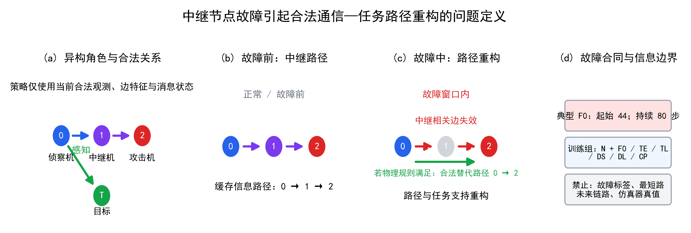
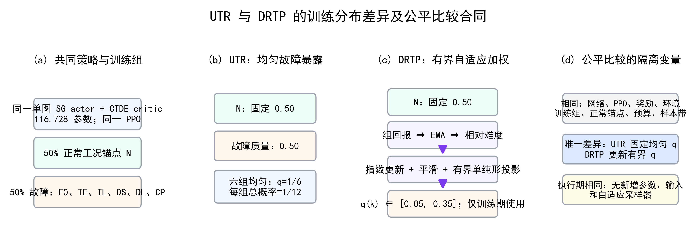
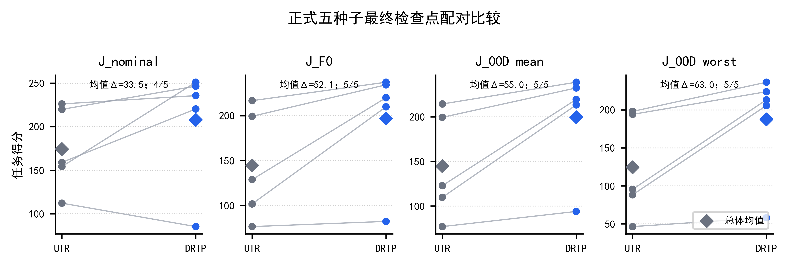
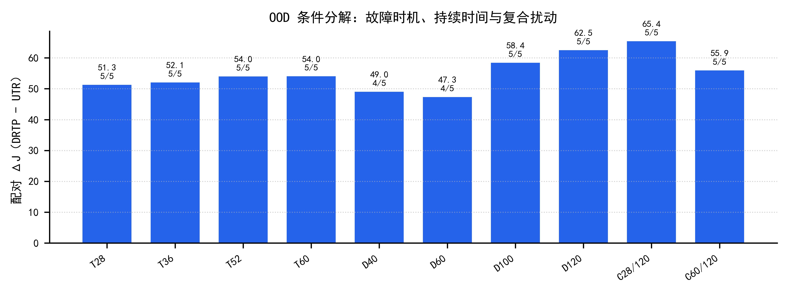
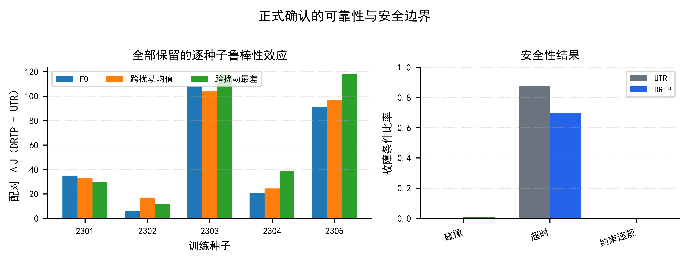
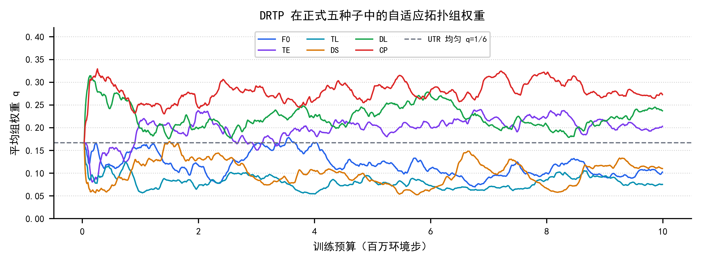
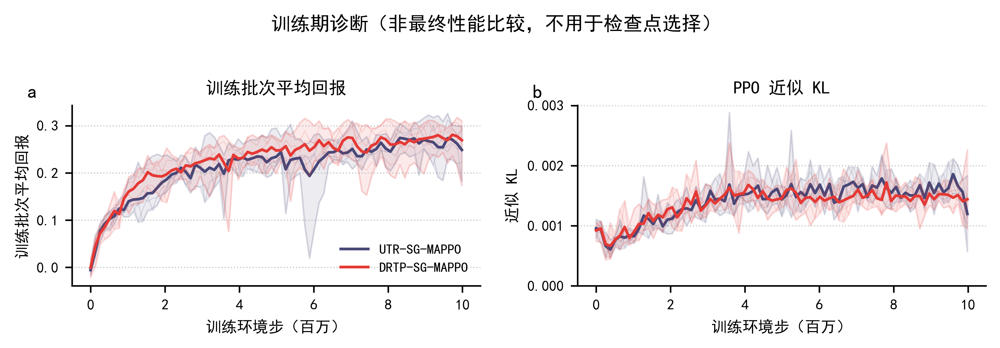

# 中继节点故障下异构多无人机拓扑鲁棒协同：有界自适应拓扑扰动重加权与种子敏感性

## 摘要

异构多无人机协同依赖角色、感知、通信与任务支持共同形成的动态关系结构。中继节点故障并不必然造成完全信息中断，却可能使合法通信由中继转发重构为直接传递，并改变任务支持来源与协同几何。针对这一结构性扰动，本文提出有界自适应拓扑扰动重加权单图 MAPPO（DRTP-SG-MAPPO，简称 DRTP）。该方法保持 116,728 参数的策略主干、PPO 目标、奖励和执行信息边界不变，在固定 50% 正常工况暴露锚点下，依据六类故障组相对正常工况的性能缺口调整训练采样权重。本文以参数量、扰动集合、训练预算和评价协议完全匹配的均匀拓扑随机化 UTR-SG-MAPPO 为主对照。正式主训练批次采用五个配对训练种子、统一 10M 预算和共同配对评价样本带；以训练种子为独立统计单位，DRTP 相对 UTR 在典型故障 F0、跨扰动均值和跨扰动最差端点上的配对差值均值分别为 52.13、55.00 和 63.01，中位数分别为 35.04、33.00 和 38.40，三个端点均为 5/5 种子正向且未出现灾难性种子。DRTP 的平均超时率由 0.874 降至 0.694，但碰撞率由 0.005 升至 0.008，表明任务收益伴随安全权衡。零训练跨评价带诊断显示，正式批次在两张评价带上均保持正向，而独立批次在两张评价带上均保持反向；一次性附加未见条件评价也重复了这一批次内方向差异。独立三方法 10M 批次中，DRTP 相对 UTR 的四个任务端点均为负向且出现灾难性种子。因此，本文将 DRTP 定位为在冻结正式批次中呈现有前景收益、但跨训练批次可靠性尚未建立的经验型拓扑扰动训练方法；不主张一般未见条件泛化、通用拓扑鲁棒保证、对随机初始化的稳定优越性，或在线自适应相对于任意固定非均匀权重的必要性。

## 关键词

异构多无人机；多智能体强化学习；通信拓扑；中继节点故障；拓扑扰动训练；自适应重加权；训练种子敏感性

## 1 引言

### 1.1 应用背景与结构性协同问题

异构无人机编队通常由具有不同感知、通信和任务执行能力的平台共同完成任务。本文关注由侦察机（Scout）、中继机（Relay）和攻击机（Attacker）组成的三机协同系统：侦察机负责获得目标信息，中继机提供潜在的多跳通信支持，攻击机利用合法获得的信息形成攻击窗口。此类系统的任务能力不仅取决于单机运动学，还取决于信息能否沿合法的感知、通信和任务支持关系传递。因此，协同策略面对的是一个随角色状态和空间几何变化的通信–任务图，而不是三个彼此独立的控制器。

中继节点故障对该图施加的是结构性扰动。冻结环境中的中继节点故障会使与中继机相连的通信边在规定时间窗内失效，但在物理规则允许时，侦察机到攻击机的直接边仍可保持合法。既有机制审计显示，故障窗口内的信息路径可由 `0–1–2` 重构为 `0–2`，任务得分同时发生下降。这一现象不能被准确描述为“完全失联后恢复信息”，因为合法直连信息并未必消失；更合适的问题是：策略能否在路径组成和任务支持关系改变后维持任务能力。

### 1.2 现有研究缺口

图结构 MARL 已经表明显式表示智能体关系有助于协同决策，通信感知型无人机 MARL 也研究了连通性、通信资源、轨迹和中继选择等问题[2--3,6--9]。鲁棒 MARL 与分布鲁棒强化学习进一步从对手变化、模型不确定性或环境分布变化角度研究策略性能[4--5]。在多无人机通信网络中，节点失效可触发拓扑重组或改变可用转发路径[15--16]。这些工作构成本文的直接知识基础，但尚不能替代本文的受控比较：本任务同时要求固定异构角色、合法去中心化信息边界、明确的中继节点故障语义，以及故障时机、持续时间和复合拓扑扰动。

另一个缺口来自训练分布。若所有故障组始终以相同概率采样，训练可能在容易条件上重复消耗预算，而对当前策略更困难的拓扑扰动投入不足。相反，如果采样权重完全由历史回报自由驱动，又可能形成对训练种子敏感的反馈。因而需要检验一个受约束的问题：在保持正常工况暴露比例、策略网络和 PPO 不变的前提下，有界自适应故障组加权能否改善平均与最差拓扑鲁棒性，并且这种收益在不同训练种子上是否可靠。

本文将可辨识问题限定为“有界自适应加权相对于均匀加权的增量效果”。正式主 cohort 未同步设置固定的、预先指定的非均匀权重对照；后续独立 cohort 虽包含固定非均匀 SNR 对照，却与正式主 cohort 的种子和评价 tape 不同且未复现 DRTP 的正向方向。因此，现有证据不能单独证明在线自适应机制相对于所有静态非均匀方案的必要性；该限制在讨论和结论中明确保留，而不借助措辞扩大方法主张。

### 1.3 本文方法与研究问题

本文以 116,728 参数的匹配单图 MAPPO 为共同策略主干。均匀拓扑随机化方法 UTR-SG-MAPPO 固定使用 50% 正常工况轨迹，并将其余 50% 均匀分配给六个故障组。DRTP-SG-MAPPO 保持相同的正常工况锚点，只根据各组回报相对正常工况任务能力的差异更新有界权重。两种方法具有相同的网络、PPO、环境、奖励、拓扑组、训练预算和配对评估样本带，唯一预期差异是均匀加权与自适应加权。

围绕这一设计，本文回答三个问题。第一，中继节点故障是否确实引起合法拓扑与路径组成重构，而不是仅仅制造一个抽象噪声标签？第二，在同等容量和暴露范围下，自适应扰动加权能否提高 F0、跨扰动均值和跨扰动最差条件表现，同时保持正常工况任务能力与安全边界？第三，平均收益是否能跨训练种子保持，还是会出现需要在主文中报告的严重反转？

### 1.4 贡献

本文贡献概括如下。

1. 构建一个面向中继节点故障诱发拓扑与路径重构的异构无人机鲁棒协同问题。问题定义保留合法直连路径和严格的策略网络信息边界，避免将拓扑重构错误表述为完全信息中断或信息恢复。
2. 提出 DRTP-SG-MAPPO。该方法不改变网络、PPO、奖励或执行期输入，仅在固定正常工况锚点下对六类预定义拓扑扰动实施有界自适应加权，从而将方法差异集中于训练分布。
3. 建立参数与暴露范围完全匹配的 UTR–DRTP 主消融，并通过五个训练前冻结配对训练种子、统一 10M 最终检查点、共同 12 条件配对评估样本带、跨扰动最差条件、安全指标与风险集触发有效性评价自适应加权。
4. 将训练可靠性纳入主结论。所有训练种子均被保留，历史不利种子和正式实验中的潜在灾难性种子不被作为“异常值”删除，平均性能与最差训练结果并列报告。

## 2 相关工作

### 2.1 图结构多智能体强化学习

图神经网络为多智能体系统提供了与智能体数量和关系结构相适配的表示方式。图注意力与拓扑感知策略梯度方法通常根据邻接关系聚合邻居信息，使策略能够利用交互结构，而不必将所有智能体状态拼接为固定长度向量[2--3]。图结构方法也已用于多无人机协同搜索、跟踪和集群控制[6--7]。这些研究说明“使用图”本身已不能构成充分创新。本文不提出新的图编码器，而是固定同一个单图策略网络与价值网络，将研究焦点转向拓扑扰动训练分布。

### 2.2 鲁棒与分布变化下的多智能体学习

鲁棒 MARL 研究涵盖对手策略变化、环境动力学不确定性以及最坏情况优化等路线[4]。组分布鲁棒优化、主动域随机化与强化学习课程则分别研究最差组目标、环境参数采样和任务序列选择[5,11--13]。DRTP 与这些思想存在明确知识继承关系，但贡献边界更窄：本文不建立一般 DRMDP 理论，也不声称求得严格最坏情况策略，而是在冻结的六类拓扑扰动组上实现可复现的有界经验重加权。

### 2.3 通信受限与故障条件下的多无人机协同

现有无人机通信与 MARL 工作常围绕抗干扰中继选择、通信功率、隐蔽通信或轨迹规划构建目标[8--9]。本文研究的输出不是通信吞吐量或网络连通度本身，而是中继节点故障引起路径与任务支持组成变化后，异构团队的任务得分和安全表现。因此，相关方法具有研究定位价值，但在动作空间、学习器、奖励和策略网络信息边界上并非可直接迁移的公平基线。

### 2.4 本文定位与对照边界

本文的核心经验比较是 UTR-SG-MAPPO 与 DRTP-SG-MAPPO。两者接触相同的七个训练组，具有相同参数量、PPO、环境、奖励、训练预算和配对评估样本带。该设计回答的是“在相同拓扑扰动集合上，自适应加权是否优于均匀加权”，而不是“DRTP 是否优于所有鲁棒 MARL”，也不回答“在线自适应是否优于任意固定非均匀分布”。

为补充同任务下的性能定位，本文还训练并评价了无图 MAPPO 性能参考（Non-Graph MAPPO Performance Reference，MAPPO-NoGraph）。该参考使用相同训练种子、10M 预算、环境、奖励和共同评价样本带，但移除了图消息输入，参数量为 35,771，与 UTR/DRTP 的 116,728 参数 SG 主干不同。因此，它只能回答该无图 MAPPO 参考在冻结任务中的性能位置，不能归因图结构、模型容量或 DRTP 自适应加权的单独作用。对 TAPE、M3DDPG 和相关无人机中继方法的审计表明，它们需要改变当前任务或学习合同，因而本文将其用于知识定位，不堆砌表面公平、实质不可比的对比方法。

## 3 问题建模

### 3.1 异构角色与 3DOF 环境

环境包含三架蓝方无人机和一个目标，蓝方角色依次为侦察机（智能体 0）、中继机（智能体 1）和攻击机（智能体 2）。仿真采用轻量三自由度（3DOF）运动学，时间步长为 1 s，最大时域为 260 步，水平空间半径为 50 km，高度范围为 1–9 km。每架蓝方无人机从 27 个离散动作中选择转向、爬升和加减速指令的组合。不同角色具有冻结的速度、加速度、转弯、爬升、雷达、通信和攻击几何参数。

每个策略网络（actor）的局部观测包含自身位置、速度、航向、航迹倾角、合法目标相对信息、探测状态、局部攻击窗口、能量、角色、入向连通度、消息时效和目标缓存置信度等 34 维特征。环境同时启用严格目标感知和智能体目标信息瓶颈：未探测目标且未合法接收新鲜缓存的智能体不能通过共享图获得真实目标状态。集中式价值网络（critic）仅用于集中训练分散执行（CTDE）[14]，不向策略网络增加执行期信息。

### 3.2 通信–任务图与合法信息边界

记时刻 (t) 的图为

\[
G_t=(V,E_t,X_t,Z_t),
\]

其中 (V) 包含三架 UAV 与目标节点，(X_t) 和 (Z_t) 分别表示节点和边特征。邻接矩阵采用 receiver-row 约定：

\[
A_t[i,j]=1
\]

表示接收方 (i) 当前能够合法使用来自发送方 (j) 的关系。感知边仅由冻结感知模型产生；通信边同时满足物理通信距离、节点状态和通信实现；任务支持边由已合法交付的信息与活跃任务支持状态产生，不构成额外隐藏信息通道。单图编码器使用这些合法关系的并集邻接矩阵，但策略网络不接收故障标签、最短路、未来链路或仿真器真实状态。

### 3.3 中继节点故障与路径重构

中继节点故障在冻结起始时刻 (t_f) 和持续时间 (d_f) 内禁用中继机的感知、发送与接收能力，并移除其相关通信边。典型故障 F0 定义为

\[
t_f=44,\qquad d_f=80.
\]

故障前，合法信息可能经“侦察机→中继机→攻击机”传递；故障后，若物理规则允许，“侦察机→攻击机”可继续作为合法直连路径。故障事件因此表现为

\[
0\rightarrow1\rightarrow2
\quad\longrightarrow\quad
0\rightarrow2,
\]

而不是必然的信息全失。本文将需要策略适应的对象定义为 communication-path composition、task-support source 和 coordination geometry 的变化。

**图1｜中继节点故障下的通信—任务路径重构与信息边界。** 中继相关通信关系在故障窗口内失效；若物理规则满足，侦察机至攻击机的直连仍可能合法。图中区分训练合同信息与执行期允许输入，避免将故障标签或全局拓扑真值注入策略网络。

### 3.4 正常工况、F0 与跨扰动条件

正常工况（nominal）不注入中继节点故障。除 F0 外，训练与正式评价覆盖以下扰动组：早期故障时机 `TE={(28,80),(36,80)}`、晚期故障时机 `TL={(52,80),(60,80)}`、短持续时间 `DS={(44,40),(44,60)}`、长持续时间 `DL={(44,100),(44,120)}` 和复合扰动 `CP={(28,120),(60,120)}`。括号分别表示故障起始时刻和持续时间。十个具体 onset--duration 成员同时属于训练 sampler 的组内均匀支持集和正式评价条件；正式配对评估样本带对全部方法和训练种子使用相同的 100 个基础 episode ID，并在 12 个条件间复用这些 ID，以减少场景差异对配对比较的干扰。

### 3.5 性能、安全与技术有效性 estimands

记某条件 (c) 下的平均 episode mission score 为 (J_c)。每个 episode 的 mission score 是三架蓝方无人机逐步奖励之和；它不是距离、时间或通信吞吐量等单一物理量。其共同部分奖励团队向目标接近、目标跟踪、攻击窗口、合法通信连通性及信息时效，并对其改善给予增量奖励；角色项分别奖励侦察发现、中继连通和攻击窗口，能量消耗、碰撞和约束违规施加惩罚，满足连续攻击窗口条件的任务完成给予终端奖励。因此，较高的 (J_c) 表示在既定奖励合同下更完整的“接近--信息支持--攻击窗口--完成”任务过程，但不能替代 success-at-horizon、超时、碰撞和约束违规等终局/安全指标。本文始终将这些指标并列报告。

本文报告

\[
J_{\mathrm{nominal}},\qquad J_{F0},
\]

以及十个跨扰动条件的

\[
J_{\mathrm{pert,mean}}=\frac{1}{10}\sum_{c\in\mathcal C_{\mathrm{pert}}}J_c,
\qquad
J_{\mathrm{pert,worst}}=\min_{c\in\mathcal C_{\mathrm{pert}}}J_c.
\]

其中 \(\mathcal C_{\mathrm{pert}}\) 为十个冻结的时机、持续时间和复合条件。它们的具体 onset--duration 成员已被训练 sampler 使用；因此 `J_pert,mean` 与 `J_pert,worst` 是跨扰动汇总指标，不是严格未见分布外（OOD）指标。为保持原始归档可追溯性，机器结果字段 `J_OOD_mean` 与 `J_OOD_worst` 分别映射到本文的 `J_pert,mean` 与 `J_pert,worst`。与之分开，本文还在结果冻结后一次性评价六个从训练支持集中排除的 onset--duration 成员；该评价是 post hoc 的附加未见条件证据，而非原始确认合同中的预注册 OOD 检验。

故障退化量定义为

\[
D_c=J_{\mathrm{nominal}}-J_c.
\]

方法间的同条件、同训练种子配对差值另记为

\[
\Delta J_c^{D-U}=J_c^{\mathrm{DRTP}}-J_c^{\mathrm{UTR}}.
\]

任务得分之外，本文报告碰撞率、超时率、约束违规率、episode 长度、故障触发前碰撞率和故障起始时刻存活比例。故障触发技术有效性只在计划故障起始时刻前仍存活的风险集 (R_c) 上计算：

\[
V_{\mathrm{trigger},c}=
\frac{\#\{\text{在 }R_c\text{ 中正确触发故障的 episodes}\}}
{|R_c|}.
\]

在故障起始时刻前因碰撞合法终止的 episode 不属于评估器缺陷，也不会从无条件任务得分或安全汇总中删除。

## 4 方法

### 4.1 参数匹配的单图 MAPPO

两种方法共用单图 MAPPO。对智能体 (i)，策略网络根据局部观测和合法图表示产生离散动作分布：

\[
a_{i,t}\sim\pi_\theta(a_{i,t}\mid o_{i,t},G_{i,t}).
\]

节点特征经线性编码后进入两层共享图注意力模块，图表示与本地观测表示融合后输出 27 维动作对数概率。集中式价值网络在训练期估计 (V_\phi(s_t))。训练使用标准裁剪 PPO 与广义优势估计（GAE）[10]：学习率 (3\times10^{-4})、折扣因子 0.99、GAE 系数 0.95、裁剪系数 0.2、熵系数 0.01、价值损失系数 0.5、最大梯度范数 0.5，每批执行 4 轮 PPO 更新。UTR 与 DRTP 的可训练参数量均为 116,728。

**图2｜UTR 与 DRTP 的训练分布差异和隔离变量。** 两种方法具有相同的策略网络、PPO、训练组、正常工况锚点、预算与评估协议；只有故障组权重由固定均匀分布或有界自适应规则产生不同。自适应器仅在训练期运行，不增加执行期参数或输入。

### 4.2 Uniform Topology Randomization

训练组集合为

\[
\mathcal G=\{N,F0,TE,TL,DS,DL,CP\}.
\]

UTR 固定正常工况采样质量：

\[
p_N=0.50.
\]

在故障组集合
\(
\mathcal F=\{F0,TE,TL,DS,DL,CP\}
\)
上采用条件均匀分布：

\[
q_k^{\mathrm{UTR}}=\frac{1}{6},\qquad
p_k^{\mathrm{UTR}}=(1-p_N)q_k^{\mathrm{UTR}}=\frac{1}{12}.
\]

组内两个 scenario member 再以相同概率采样。UTR 因而与 DRTP 接触完全相同的 topology-training universe。

### 4.3 DRTP 有界自适应拓扑扰动重加权

DRTP 是训练期的有界采样控制器，而不是一般 min--max 或分布鲁棒优化问题的求解器。它保持故障暴露总质量 \(1-p_N=0.50\) 不变，只在六个预定义故障组之间重新分配该质量；其可行权重集合为

\[
\mathcal Q=\left\{q\in\Delta^6:0.05\le q_k\le0.35\right\}.
\]

该采样器不改变 PPO 损失，也不近似求解一个可证明的内层对手分布。设第 (u) 个自适应边界前收集到组 (k) 的已完成 episode 平均回报为 \(\widehat J_{k,u}\)。若该组在窗口内被观测，则其指数移动平均（EMA）更新为

\[
\bar J_{k,u}=(1-\kappa)\bar J_{k,u-1}+\kappa\widehat J_{k,u};
\]

未观测组的 EMA 保持不变。Nominal EMA 采用相同规则。相对正常工况的性能缺口定义为

\[
d_{k,u}=\operatorname{clip}\!\left(
\frac{\bar J_{N,u}-\bar J_{k,u}}
{\max(|\bar J_{N,u}|,\epsilon)},0,d_{\max}
\right),
\]

并通过去均值得到中心化性能缺口

\[
\tilde d_{k,u}=d_{k,u}-\frac{1}{6}\sum_{j\in\mathcal F}d_{j,u}.
\]

指数重加权候选为

\[
\tilde q_{k,u+1}=
\frac{q_{k,u}\exp(\eta\tilde d_{k,u})}
{\sum_{j\in\mathcal F}q_{j,u}\exp(\eta\tilde d_{j,u})},
\]

最终权重经过平滑与有界单纯形投影：

\[
q_{u+1}=\Pi_{\mathcal Q}\left[(1-\beta)q_u+\beta\tilde q_{u+1}\right].
\]

这里的 \(\Pi_{\mathcal Q}\) 是对欧氏距离的有界单纯形投影，而不是逐元素截断后任意归一化。对待投影向量 \(x\)，实现寻找标量 \(\lambda\)，使

\[
q_k=\min\{0.35,\max\{0.05,x_k-\lambda\}\},
\qquad \sum_{k\in\mathcal F}q_k=1.
\]

具体地，\(\lambda\) 在区间 \([\min_k(x_k-0.35),\max_k(x_k-0.05)]\) 内以 100 次二分求解；若浮点残差仍大于 \(10^{-12}\)，则按固定组顺序在未触及上下界的分量上作最小补偿，随后断言总质量在 \(10^{-10}\) 内为 1 且所有组仍在边界内。该程序只作用于训练期的六维采样权重，不涉及策略或价值网络参数、PPO 损失或执行期输入。

冻结超参数为：初始 (q_k=1/6)，前 128 updates 均匀 warm-up，之后每 32 updates 适配一次，\(\kappa=0.20\)、\(\eta=1.00\)、\(\beta=0.50\)、\(d_{\max}=2.00\)、\(\epsilon=10^{-8}\)。该更新受组鲁棒重加权和自适应域随机化的经验动机启发[11--12]，但本文仅检验它相对均匀采样的经验效果。

### 4.4 Nominal competence anchor

DRTP 中存在两种不同的锚点。第一，(p_N=0.50) 固定正常工况暴露比例，避免自适应器将全部训练质量转移到故障条件。第二，\(\bar J_N\) 作为任务能力参照，使性能缺口表示某故障组相对正常工况的任务差距。二者均属于训练采样器，不是辅助损失，也不进入策略网络或价值网络。

### 4.5 训练流程、复杂度与信息边界

每次环境重置时，采样器先以 0.5 概率选择正常工况；否则根据 (q) 选择故障组，再在组内均匀选择故障起始时刻和持续时间。UTR 的 (q) 固定，DRTP 的 (q) 仅在自适应边界更新。组标签、故障起始时刻、持续时间、EMA、性能缺口和 (q) 只存在于训练记录和日志中。评价阶段不实例化自适应采样器。

DRTP 不增加 trainable parameter，也不改变 inference graph。其附加计算来自按组累计 episode return、EMA 更新和六维有界投影；因此论文只主张“参数量相同且无 inference-time 模块”，不在缺少共同硬件日志的情况下声称 wall-clock 或显存优势。

## 5 实验协议

### 5.1 正式方法与公平性合同

正式实验仅比较 UTR-SG-MAPPO 和 DRTP-SG-MAPPO。每个方法使用训练种子 2301–2305，共十条从零开始、严格连续的训练轨迹。每条轨迹训练 39,063 次更新，采用 4 个并行环境和 64 步轨迹片段，对应 10,000,128 个环境步。所有方法使用相同的网络、PPO、S2 冻结环境、奖励、七个拓扑组、50% 正常工况锚点、运行时状态持久化和检查点规则。该 UTR–DRTP 比较是本文的参数匹配主消融，识别的是均匀训练分布与有界自适应训练分布之间的差异，而不是对所有外部算法的排行榜比较。

最终比较只使用共同 10M 最终检查点。每 0.5M 保存的里程碑检查点仅用于学习曲线和中断恢复，不允许最佳检查点晋升、提前停止、训练种子排除或性能驱动重跑。

为避免不同对照承担的科学问题被混淆，本文将证据分为表1所列层级。主结论只依赖第一层的 UTR–DRTP 同构比较；外部 MAPPO-NoGraph、遥测、历史分层结果和相关工作均不替代该因果主消融。MAPPO-NoGraph 的五种子归档、共同 tape 和完整安全记录已经独立核验，故将其作为外部性能参考完整报告；但本文不把内部主消融或单个外部参考包装为外部算法排行榜。

**表1｜对照与证据层级。**

| 层级 | 证据对象 | 保持不变的因素 | 能回答的问题 | 不能回答的问题 |
|---|---|---|---|---|
| 主因果消融 | UTR-SG-MAPPO vs DRTP-SG-MAPPO | SG actor/critic、116,728 参数、PPO、环境、奖励、七组、50% 正常工况锚点、预算与样本带 | 有界自适应加权相对均匀加权的增量效果 | 自适应是否优于任意静态非均匀权重；是否优于所有外部算法 |
| 外部性能参考 | MAPPO-NoGraph vs UTR/DRTP | 环境、奖励、种子、10M 预算与评价 tape；网络消息输入和参数量不同（35,771 vs 116,728） | 无图 MAPPO 参考在冻结任务中的绝对性能与安全位置 | 图结构、容量或自适应加权的单独因果效果；外部算法排行榜 |
| 机制一致性诊断 | DRTP 权重、实际暴露、路径/任务支持遥测 | 同一正式训练与最终评价记录 | 自适应器是否实际改变训练暴露，结果是否与路径利用差异相一致 | 权重变化对特定策略行为的因果机制 |
| 可靠性背景 | 历史开发、留出验证与多样本带审计 | 各自历史合同内部 | 为什么训练种子风险必须进入解释边界 | 与正式五种子合并后的总体显著性或新主结论 |
| 文献定位 | 图 MARL、鲁棒 MARL 和通信受限 UAV 工作 | 不适用 | 研究问题与既有路线的关系 | 与当前动作、信息和训练合同下的直接性能排序 |

### 5.2 正式配对评估样本带

正式配对评估样本带使用 episode ID 490000–490099，在正常工况、F0、四个故障时机、四个故障持续时间和两个复合条件间复用同一组基础 ID。每个“方法×训练种子×条件”评价 100 个 episode，总计 12,000 条原始评估记录。样本带在看到正式性能前生成并冻结，其清单与哈希必须与汇总脚本一致。

### 5.3 历史证据与正式证据分层

为避免把不同阶段的证据误写成一条连续、同质的实验，本文采用如下时间线。阶段标签表示证据用途和合同边界，不表示在上一阶段结果上挑选或晋升检查点。

| 阶段 | 训练种子与预算 | 方法/配置边界 | 本文中的证据用途 |
|---|---|---|---|
| 历史开发 | 1901/1902，3M | 历史开发合同；不与正式 cohort 合并 | 可学习性与早期可靠性背景；历史 `NO-GO` 永久保留 |
| 历史留出验证 | 2001/2002/2003，10M | 历史 held-out 合同；不与正式 cohort 合并 | 历史确认尝试与失败证据；`FAIL` 永久保留 |
| 正式主 cohort | 2301--2305，10M | 正式五种子冻结合同；共同评价带；最终检查点 | UTR--DRTP 主因果消融与正式门槛证据 |
| 独立重复 cohort | 2401--2405，10M | 独立三方法合同；独立评价带；最终检查点 | 可靠性/重复性证据；不改写或合并正式主 cohort |

因此，本文对阶段变化的处理是“按各阶段冻结合同分层解释”，而不是把历史或独立阶段的结果回填为正式主实验的配置或统计重复。正式主 cohort 与独立 cohort 的方向差异以及两套评价带上的保持方向，均按各自原始合同完整披露。

历史开发阶段 3M（训练种子 1901/1902）与留出验证 10M（训练种子 2001/2002/2003）保留为来源追踪和可靠性背景。另一个独立三方法 cohort 使用训练种子 2401--2405、独立评价 tape 和共同 10M 终点；其完整结果在第6.9节及补充材料S4披露。三类 strata 的训练种子、训练目的和评价合同不同，均不能与正式训练种子 2301–2305 合并成一个同质 (n=10) 实验。历史开发阶段 `NO-GO`、留出验证 `FAIL`、训练种子 1902 的弱表现、训练种子 2002 的灾难性反转以及独立 cohort 的方向反转均永久保留。

### 5.4 指标与统计单位

独立统计单位是配对训练种子（正式实验 (n=5)），而不是评估 episode。本文将指标分为三类：主要性能端点是 (J_{F0})、(J_{\mathrm{pert,mean}}) 和 (J_{\mathrm{pert,worst}})；正常工况端点 (J_{\mathrm{nominal}}) 用于保持性边界；碰撞、超时、约束违规、触发前碰撞、存活至起始时刻比例和风险集触发有效性用于安全与技术有效性诊断。路径、任务支持、合法信息和缓存时效遥测仅作机制一致性证据，不能承担方法优越性的统计检验。

对四个任务端点，本文报告 UTR 与 DRTP 绝对值、每个训练种子的 DRTP−UTR 差值与配对比值，以及差值的均值、中位数、样本标准差、四分位距（IQR）、中位绝对偏差（MAD）、胜出种子数和最佳/最差差值。该报告同时呈现中心趋势与最弱配对结果，避免仅由少数高收益种子支撑平均值。若报告自助法区间，必须明确其为小样本描述性区间，不能用按 episode 混合计算的 p 值扩大方法优越性结论。

### 5.5 安全性、故障暴露与灾难性种子规则

安全指标包括碰撞率、超时率和约束违规率。所有计划故障 episode 均保留在无条件任务得分和安全统计中。故障触发前碰撞单独报告；技术触发有效性在故障起始时刻仍存活的风险集上计算。

正式合同继承预先冻结的灾难性种子定义。若同一配对训练种子满足以下任一组合，则该 DRTP 训练种子被标记为灾难性种子：

\[
\frac{J_{F0}^{D}}{J_{F0}^{U}}<0.70
\quad\text{且}\quad
\frac{J_{\mathrm{pert,worst}}^{D}}{J_{\mathrm{pert,worst}}^{U}}<0.85,
\]

或

\[
\frac{J_{\mathrm{pert,worst}}^{D}}{J_{\mathrm{pert,worst}}^{U}}<0.70
\quad\text{且}\quad
\frac{J_{F0}^{D}}{J_{F0}^{U}}<0.85.
\]

此外，若超时率增量大于 0.20，且 F0 或 跨扰动最差条件的配对比值小于 0.85，也判为灾难性种子。该阈值在正式训练种子开始训练前冻结，不能根据结果修改。

正式合同中的**正常工况保持**是总体门槛，而非“每个种子均不退化”的承诺：

\[
\frac{\overline J_{\mathrm{nominal}}^{D}}
{\overline J_{\mathrm{nominal}}^{U}}\ge0.95,
\qquad
\operatorname{median}_{s}\!\left(J_{\mathrm{nominal},s}^{D}-J_{\mathrm{nominal},s}^{U}\right)\ge0.
\]

其中横线表示五个配对训练种子的总体均值，\(s\) 表示训练种子。该门槛与灾难性种子规则同样在正式训练前冻结；它必须与逐种子结果同时阅读，不能将总体通过误写为每个随机初始化均保持正常工况能力。

## 6 结果

本节按“合同完整性—绝对性能—配对种子效应—条件边界—安全与触发有效性—机制遥测—历史与独立重复可靠性”的顺序呈现。前五项构成正式五种子主证据；遥测、历史和独立重复证据用于限定解释范围，而不替代或选择性改写正式主 cohort 的最终检查点比较。

### 6.1 中继节点故障引起合法拓扑与路径重构

冻结的 S1/S2 机制审计表明，暴露于故障窗口后，两条中继通信边失效，而合法的“侦察机→攻击机”直连边与配对正常工况轨迹相比保持可用。攻击机的缓存路径由 `0–1–2` 转为 `0–2`。与此同时，已有配对诊断中的故障任务得分低于正常工况。该证据支持

\[
\text{中继节点故障}
\rightarrow
\text{topology/path reconfiguration}
\rightarrow
\text{mission degradation},
\]

但不支持“合法信息必然减少”或“DRTP 恢复丢失信息”的叙述。

### 6.2 正式五种子绝对结果

图3和表2首先给出绝对性能，而非只报告差值。DRTP 的四个任务端点均高于 UTR：正常工况为 207.78 对 174.30，F0 为 196.77 对 144.64，跨扰动均值为 199.70 对 144.70，跨扰动最差条件为 187.45 对 124.44。故障条件下，DRTP 的平均超时率低于 UTR（0.694 对 0.874），约束违规率均为 0；碰撞率则由 0.005 小幅升至 0.008。该安全权衡按训练前冻结规则未触发安全失败，但不应被任务得分掩盖。

**图3｜正式五种子最终检查点的主要任务端点。** 灰线连接同一训练种子的 UTR 与 DRTP；菱形为五个训练种子的总体均值。图中呈现全部配对训练种子，不将 episode 当作独立训练重复。

**表2｜正式五种子总体结果。** 所有数值来自共同 10M 最终检查点；训练种子为独立统计单位（n=5）。

| 方法 | 参数量 | (J_{nominal}) | (J_{F0}) | (J_{pert,mean}) | (J_{pert,worst}) | 碰撞率 | 超时率 | 约束违规率 |
|---|---:|---:|---:|---:|---:|---:|---:|---:|
| UTR-SG-MAPPO | 116,728 | 174.30 | 144.64 | 144.70 | 124.44 | 0.005 | 0.874 | 0.000 |
| DRTP-SG-MAPPO | 116,728 | 207.78 | 196.77 | 199.70 | 187.45 | 0.008 | 0.694 | 0.000 |

### 6.3 无图 MAPPO 性能参考（Non-Graph MAPPO Performance Reference）

作为外部定位而非主因果消融，MAPPO-NoGraph 在相同种子、共同 10M 终点和 `490000–490099` 评价 tape 下完成五条训练轨迹及 6,000 条原始评价记录。表2b显示，MAPPO-NoGraph 的四个任务端点均高于 UTR 的总体均值，但其网络不含图消息输入且参数量仅为 35,771，不能据此将 UTR 与 MAPPO 的差异归因于图结构本身。

相对于 MAPPO-NoGraph，DRTP 的正常工况、F0、跨扰动均值和跨扰动最差端点的配对差值均值分别为 +1.20、+3.08、+9.63 和 +7.68，中位数分别为 +33.28、+21.60、+26.58 和 +26.33，四个端点均为 4/5 种子正向。与此同时，MAPPO-NoGraph 的故障平均碰撞率和超时率均更低（0.002、0.601，对应 DRTP 为 0.008、0.694）。因此，该外部参考支持 DRTP 在任务端点上的受限性能定位，却不支持“DRTP 在全部安全指标上绝对最优”或“图结构单独导致优势”的表述。

**表2b｜无图 MAPPO 性能参考结果。** 五个训练种子、最终 10M 检查点和共同 12 条件评价 tape 全部保留；参数差异意味着此表不替代表2的 UTR–DRTP 主消融。

| 方法 | 参数量 | (J_{nominal}) | (J_{F0}) | (J_{pert,mean}) | (J_{pert,worst}) | 碰撞率 | 超时率 | 约束违规率 |
|---|---:|---:|---:|---:|---:|---:|---:|---:|
| UTR-SG-MAPPO | 116,728 | 174.30 | 144.64 | 144.70 | 124.44 | 0.005 | 0.874 | 0.000 |
| DRTP-SG-MAPPO | 116,728 | 207.78 | 196.77 | 199.70 | 187.45 | 0.008 | 0.694 | 0.000 |
| MAPPO-NoGraph | 35,771 | 206.59 | 193.69 | 190.06 | 179.77 | 0.002 | 0.601 | 0.000 |

| 方向：DRTP − MAPPO-NoGraph | 均值 | 中位数 | DRTP 正向种子 | 最差配对差值 |
|---|---:|---:|---:|---:|
| (J_{nominal}) | +1.20 | +33.28 | 4/5 | -50.04 |
| (J_{F0}) | +3.08 | +21.60 | 4/5 | -53.62 |
| (J_{pert,mean}) | +9.63 | +26.58 | 4/5 | -57.45 |
| (J_{pert,worst}) | +7.68 | +26.33 | 4/5 | -70.89 |

### 6.4 配对种子效应与训练可靠性

表3与图5保留所有五个配对训练种子。DRTP 在 F0、跨扰动均值和跨扰动最差条件上分别实现 5/5、5/5 和 5/5 的正向配对差值；其均值/中位数分别为 52.13/35.04、55.00/33.00 和 63.01/38.40。正常工况上，4/5 种子有利，平均差值为 33.48；seed2302 出现 −26.90 的正常工况差值（配对比值 0.760），但该种子在三个鲁棒性端点仍均为正。正式总体正常工况比值为 1.192，且正常工况配对差值中位数为 26.66，因而满足前述总体保持门槛；这不等价于“每个种子均保持正常工况能力”。五个种子均未满足训练前冻结的灾难性种子组合定义，故正式确认门槛通过，但结论不能写成“稳定优越”。

| 训练种子 | Δ正常工况 | ΔF0 | Δ跨扰动均值 | Δ跨扰动最差 | Δ碰撞率 | Δ超时率 | 灾难性种子 |
|---:|---:|---:|---:|---:|---:|---:|---|
| 2301 | 26.66 | 35.04 | 33.00 | 29.78 | -0.010 | -0.485 | 否 |
| 2302 | -26.90 | 5.79 | 17.01 | 11.71 | 0.000 | -0.001 | 否 |
| 2303 | 96.84 | 108.15 | 103.78 | 117.39 | -0.014 | -0.338 | 否 |
| 2304 | 9.53 | 20.55 | 24.42 | 38.40 | 0.040 | 0.018 | 否 |
| 2305 | 61.29 | 91.14 | 96.79 | 117.78 | -0.002 | -0.095 | 否 |

| 端点 | 均值 | 中位数 | SD | IQR | MAD | 胜出种子数 | 最差差值 |
|---|---:|---:|---:|---:|---:|---:|---:|
| J_nominal | 33.48 | 26.66 | 47.58 | 51.76 | 34.63 | 4/5 | -26.90 |
| J_F0 | 52.13 | 35.04 | 44.99 | 70.60 | 29.25 | 5/5 | 5.79 |
| J_pert,mean | 55.00 | 33.00 | 41.80 | 72.37 | 15.99 | 5/5 | 17.01 |
| J_pert,worst | 63.01 | 38.40 | 50.74 | 87.61 | 26.69 | 5/5 | 11.71 |

为区分“DRTP 的正常工况本身更强”和“故障后相对自身正常能力下降更少”，本文进一步报告正式主 cohort 的总体故障退化量 \(D_c=J_{\mathrm{nominal}}-J_c\)。

| 退化端点 | UTR | DRTP | DRTP−UTR |
|---|---:|---:|---:|
| (D_{F0}) | 29.66 | 11.01 | -18.65 |
| (D_{\mathrm{pert,mean}}) | 29.60 | 8.08 | -21.52 |
| (D_{\mathrm{pert,worst}}) | 49.86 | 20.33 | -29.53 |

上述负值表示 DRTP 的总体相对退化量较小；它们是总体端点的描述性分解，不能替代以训练种子为独立单位的配对差值，也不能推出每个训练种子均具有较小退化量。

### 6.5 故障时机、持续时间与复合跨扰动条件

图4和表4表明，DRTP 的收益并不集中于单一 F0 条件。十个跨扰动条件的平均配对差值均为正；四个故障时机条件和两个复合条件均为 5/5 种子有利。持续时间条件中，D40 与 D60 分别为 4/5 种子有利，且其最差配对差值分别为 -1.26 与 -21.30，故不宜把持续时间泛化表述为无条件成立。其余八个条件的最差配对差值均为正。

**图4｜正式五种子下十个跨扰动条件的配对任务得分差值。** 柱形为五个训练种子的平均配对 ΔJ(D-U)=J(DRTP)-J(UTR)，柱顶为正向种子数；训练种子而非 episode 是独立统计单位。图中条件属于已见训练扰动族，因而不作为严格 OOD 证据。

| 条件 | UTR均值 | DRTP均值 | 平均配对ΔJ(D-U) | 中位数ΔJ(D-U) | 胜出种子数 | 最差配对ΔJ(D-U) |
|---|---:|---:|---:|---:|---:|---:|
| T28 | 140.41 | 191.71 | 51.30 | 28.63 | 5/5 | 2.62 |
| T36 | 140.91 | 192.96 | 52.05 | 33.37 | 5/5 | 8.13 |
| T52 | 147.78 | 201.78 | 54.00 | 34.82 | 5/5 | 17.46 |
| T60 | 155.63 | 209.67 | 54.04 | 35.71 | 5/5 | 16.16 |
| D40 | 151.85 | 200.90 | 49.05 | 37.29 | 4/5 | -1.26 |
| D60 | 146.83 | 194.16 | 47.33 | 36.11 | 4/5 | -21.30 |
| D100 | 141.64 | 200.05 | 58.41 | 34.45 | 5/5 | 21.41 |
| D120 | 138.47 | 200.99 | 62.52 | 39.11 | 5/5 | 27.80 |
| C28/120 | 130.68 | 196.06 | 65.38 | 52.65 | 5/5 | 26.44 |
| C60/120 | 152.77 | 208.68 | 55.91 | 35.11 | 5/5 | 19.88 |

该部分用于判断收益是否集中在已见的 F0 条件，还是能够覆盖故障起始时刻、持续时间和复合扰动变化。对最差条件的解释必须同时给出绝对 (J) 和配对差值，避免“正常工况性能过低导致假鲁棒”。

### 6.6 安全性、故障触发前终止与风险集有效性

风险集审计覆盖两种方法各 5,500 个计划故障 episode。UTR 有 5,492 个 episode 存活至计划故障起始时刻（99.855%），其中全部正确触发；DRTP 相应为 5,464 个（99.345%），其中也全部正确触发。未进入风险集的 episode 均为故障起始前碰撞：UTR 为 8 个（0.145%），DRTP 为 36 个（0.655%）。这些记录保留在总体回报和安全性分母中，不因未暴露而删除。

正式故障条件下，DRTP 的超时率由 0.874 降至 0.694，碰撞率由 0.005 升至 0.008，约束违规率两者均为 0。故，DRTP 的回报改善与超时减少方向一致，但仍存在小幅碰撞率上升；这一权衡需与表2和图5共同阅读。

为避免 pooled 率掩盖安全性集中于个别训练种子的可能性，表5a给出 11 个故障条件、每种子 1,100 个 episode 的种子级安全审计。DRTP 的碰撞增量主要来自 seed2304（0.040 对 0.000），同时该种子的超时率也略增（0.719 对 0.701）；其余四个种子的碰撞率不高于 UTR。这个模式不允许将 DRTP 概括为“全面更安全”，但支持“平均超时减少伴随局部碰撞代价”的受限表述。

**表5a｜正式五种子的故障条件安全性与触发前终止。** 比率以同一训练种子的 1,100 个计划故障 episode 为分母；trigger validity 是存活至故障起始时刻的风险集内正确触发比例。

| 种子 | 方法 | 碰撞率 | 超时率 | 约束违规率 | 触发前碰撞率 | 起始时刻存活率 | trigger validity |
|---:|---|---:|---:|---:|---:|---:|---:|
| 2301 | UTR | 0.010 | 0.981 | 0.000 | 0.007 | 0.993 | 1.000 |
| 2301 | DRTP | 0.000 | 0.495 | 0.000 | 0.000 | 1.000 | 1.000 |
| 2302 | UTR | 0.000 | 0.944 | 0.000 | 0.000 | 1.000 | 1.000 |
| 2302 | DRTP | 0.000 | 0.943 | 0.000 | 0.000 | 1.000 | 1.000 |
| 2303 | UTR | 0.014 | 0.985 | 0.000 | 0.000 | 1.000 | 1.000 |
| 2303 | DRTP | 0.000 | 0.646 | 0.000 | 0.000 | 1.000 | 1.000 |
| 2304 | UTR | 0.000 | 0.701 | 0.000 | 0.000 | 1.000 | 1.000 |
| 2304 | DRTP | 0.040 | 0.719 | 0.000 | 0.033 | 0.967 | 1.000 |
| 2305 | UTR | 0.002 | 0.761 | 0.000 | 0.000 | 1.000 | 1.000 |
| 2305 | DRTP | 0.000 | 0.665 | 0.000 | 0.000 | 1.000 | 1.000 |

**图5｜正式五种子的可靠性与安全边界。** 左图保留每一个训练种子的 F0、跨扰动均值和跨扰动最差配对差值；右图为故障条件的总体碰撞、超时与约束违规率。所有计划故障 episode 仍保留在总体指标中；风险集仅用于判定触发器技术有效性。

若 episode 在计划故障起始时刻前碰撞终止，该记录继续计入总体任务得分和碰撞率，不重新标记为已暴露。只有存活至故障起始时刻的 episode 才进入触发有效性分母。正式技术有效性要求所有存活至故障起始时刻的故障 episode 均正确触发。

为避免只用任务得分概括终局行为，补充图S1将正式原始记录按正常工况、F0、时机扰动、持续时间扰动和复合扰动汇总。DRTP 在五类条件下的任务完成率均高于 UTR：例如 F0 为 0.278 对 0.116，复合扰动为 0.317 对 0.107；对应超时率分别由 0.880 降至 0.714、由 0.889 降至 0.675。碰撞率在所有故障条件族中均维持低绝对值，但 DRTP 多数条件族略高。因此，任务得分优势与更高完成率、较少超时相一致，却不能被解读为所有安全端点均获改善。

### 6.7 自适应权重与机制遥测

DRTP 的采样器在五个正式种子中实际偏离了均匀故障组权重。末次权重更新（update 39,040）时，复合扰动 CP、长持续时间 DL 和早故障 TE 的平均 q 分别为 0.273、0.237 和 0.203，高于均匀六组权重 1/6；F0、TL 与 DS 分别为 0.102、0.075 和 0.110。对应的实际训练 episode 计数为 CP 26,804、DL 21,619、TE 19,226、F0 11,487、DS 9,747、TL 7,962，另有固定正常工况锚点 N 96,822。图6给出完整训练历程。

**图6｜正式五种子中 DRTP 的拓扑组权重轨迹。** 曲线是五个训练种子在相同更新点的平均 q，虚线为 UTR 的均匀故障组权重 1/6。该图仅证明自适应器实际改变了训练暴露；不单独建立“权重变化导致特定策略行为”的因果解释。

在最终故障评估中，DRTP 的任务支持关系占比为 0.630，高于 UTR 的 0.508；直接路径占比为 0.219，低于 UTR 的 0.275；合法信息占比为 0.892，高于 UTR 的 0.802；平均缓存时效为 16.62，低于 UTR 的 18.96。路径切换次数则由 8.06 降至 6.56。上述遥测与更有针对性的扰动暴露和不同的路径/任务支持利用相一致，但不是策略机制的因果证明。

机制分析还应展示路径切换次数、直连路径占比、中继路径占比、任务支持占比、合法信息占比、缓存时效、航程和控制代价。允许的解释是“结果与更有针对性的扰动暴露和不同的路径/任务支持利用相一致”；除非有受控因果证据，不得写成“自适应加权导致某一确定策略吸引域”或“恢复信息”。

### 6.8 历史可靠性证据

正式结果之外，历史分层证据用于说明为什么训练可靠性必须进入论文主文。开发阶段 3M 中，DRTP 汇总的正常工况、F0、跨扰动均值和跨扰动最差条件得分均高于 UTR，但训练种子 1902 在 F0 和跨扰动均值上方向不利。留出验证 10M 中，训练种子 2001 和 2003 获益，而训练种子 2002 在 F0、跨扰动条件和超时率上发生严重反转，导致留出验证裁决为 `FAIL`。这些历史结果不能与正式五种子作为一个同质样本合并，但必须作为方法风险和结果解释边界保留。

### 6.9 独立三方法重复 cohort 与跨 cohort 可靠性

为检验结论是否仅受单一正式 cohort 支配，本文完整披露随后完成的独立三方法 10M cohort。该 cohort 使用此前未参与正式主 cohort 的训练种子 2401、2402、2403、2404 和 2405，以 UTR、固定非均匀权重 SNR 和 DRTP 三种方法从零开始严格连续训练至相同 10M 终点；三者各有五条轨迹，并在独立 `500000–500099` 评价 tape 上保留 18,000 条原始 episode 记录。其环境、奖励、PPO、SG 主干、116,728 参数、七个拓扑组、50% 正常工况锚点和最终检查点规则保持冻结。该 cohort 的全部原始记录、逐条件汇总、检查点哈希和风险集字段见补充材料表S4--S6及源数据包；不能以其局部种子替代或选择性修正正式主 cohort。

该独立 cohort 的总体方向与正式主 cohort 不同：UTR 在四个任务端点上均高于 DRTP，DRTP 相对 UTR 的配对均值（中位数）分别为正常工况 -38.35（-27.96）、F0 -33.27（-25.10）、跨扰动均值 -34.07（-29.14）和跨扰动最差端点 -32.36（-51.66），四项均仅有 1/5 或 2/5 训练种子为正；DRTP 还出现 1 个按既有规则判定的灾难性种子。故障平均碰撞率和超时率分别为 0.052 与 0.678，高于 UTR 的 0.009 与 0.646；所有存活至计划故障起始时刻的 episode 均正确触发。SNR 在该独立 cohort 中也未优于 UTR，因而该 cohort 既不证明静态非均匀权重优越，也不能用来声称在线自适应已被单独识别为必要机制。

**表6｜独立三方法重复 cohort 的完整汇总。** 每种方法为 5 个独立训练种子；本表只描述种子 2401--2405 cohort，不与表2的正式种子 2301--2305 合并为 (n=10)。碰撞与超时为 11 个故障条件的种子均值再平均。

| 方法 | J_nominal | J_F0 | J_pert,mean | J_pert,worst | 碰撞 | 超时 | 风险集 trigger validity |
|---|---:|---:|---:|---:|---:|---:|---:|
| UTR-SG-MAPPO | 225.70 | 199.40 | 200.48 | 181.98 | 0.009 | 0.646 | 1.000 |
| 固定非均匀 SNR-SG-MAPPO | 184.64 | 183.07 | 178.00 | 159.63 | 0.014 | 0.661 | 1.000 |
| DRTP-SG-MAPPO | 187.35 | 166.13 | 166.41 | 149.61 | 0.052 | 0.678 | 1.000 |

这一重复结果不回写正式主 cohort 的事实：后者在自身训练前冻结合同下仍完整、正向且无灾难性种子。它改变的是可推广的表述边界：跨 cohort 观察到方向反转，因而不能把正式主 cohort 的均值收益叙述为可跨初始化或训练 cohort 稳定复现的性能保证。本文也不将两批异质 cohort 汇总成一个表面更大的样本量，或以任何 cohort 的表现选择、删除训练种子。

### 6.10 跨评价带可靠性诊断

为区分训练 cohort 效应与评价样本带效应，本文在不训练、不修改检查点的条件下，将正式 cohort 和独立 cohort 的全部最终检查点分别置于两张冻结评价带上重评。该零训练诊断覆盖两个 cohort、两种方法、五个训练种子、两张评价带和 12 个评价条件，共 48,000 条原始 episode 记录；两批 cohort 仍分层报告，不合并为 (n=10)。

| 训练 cohort | 评价带 | 配对ΔJ(D-U)_F0 | 配对ΔJ(D-U)_pert,mean | 配对ΔJ(D-U)_pert,worst | 主要方向 |
|---|---|---:|---:|---:|---|
| 正式 2301--2305 | tape490 | +52.13 | +55.00 | +63.01 | 正向 |
| 正式 2301--2305 | tape500 | +60.25 | +61.07 | +68.31 | 正向 |
| 独立 2401--2405 | tape490 | -33.58 | -35.37 | -37.10 | 反向 |
| 独立 2401--2405 | tape500 | -33.11 | -34.07 | -32.36 | 反向 |

其中 Δ 表示同一训练种子下 DRTP 减 UTR 的配对差值。三个主要鲁棒性端点在两个 cohort 内均保持相同方向，说明“正式 cohort 正向、独立 cohort 反向”的主要矛盾不能由评价带更换单独解释。该诊断支持将训练 cohort/seed 敏感性作为实证限制，但不能进一步识别具体随机源、策略吸引域或优化因果机制，也不改变任一 cohort 原有的合同内裁决。

### 6.11 附加未见 onset--duration 条件评价

在主结果冻结后，本文以一张新的 `510000--510099` 确定性评价 tape 对两个 cohort 的全部 20 个 UTR/DRTP 最终 checkpoint 作一次性零训练评价。六个 onset--duration 成员为 T20--D80、T68--D80、T44--D20、T44--D140、C20--D140 和 C68--D40；它们均不属于训练 sampler 的十一种具体故障成员。每个“cohort×方法×训练种子×条件”单元评价 100 个 episode，总计 12,000 条原始记录。该评价在主合同之后冻结，故仅作为附加未见条件证据，不能倒写为原始确认性 OOD 结论。

| cohort | 六个未见条件的 DRTP−UTR 平均ΔJ 范围 | 中位数方向 | 正向 seed 数 | 解释 |
|---|---:|---|---|---|
| 正式 2301--2305 | +35.36 至 +70.85 | 六项均正 | 4/5 或 5/5 | 与正式 cohort 的正向任务收益一致 |
| 独立 2401--2405 | −25.20 至 −49.46 | 六项均负 | 1/5 或 2/5 | 与独立 cohort 的反向结果一致 |

正式 cohort 的六项最差配对差中，T20--D80、T44--D140 和 C20--D140 仍为正；其余三项各有一个不利 seed。独立 cohort 的每一项中位数均为负，最差配对差为 −69.61 至 −140.87。两批 cohort 的所有风险集 trigger validity 均为 1.000，最小存活至起始时刻比例分别为 0.98 与 0.99；触发前碰撞仍保留在全部无条件指标内。安全性上，正式 cohort 的平均超时差在六项中均不为正，而独立 cohort 除 T44--D140 外的五项平均超时差为正。这一额外评价同时增加了“正式 cohort 对训练未见成员的经验收益”与“方向依赖训练 cohort”的证据；它不允许将任一 cohort 的结果外推为一般未见分布保证。

## 7 讨论

### 7.1 自适应扰动加权的作用范围

DRTP 的设计价值在于把模型容量、拓扑语义和奖励等因素固定后，检验训练分布控制相对于均匀加权的增量效果。正式五种子主 cohort 支持：在该 cohort 的三无人机中继故障任务、共同 10M 预算和训练前冻结评价条件下，有界自适应故障组加权相对均匀拓扑随机化提高了任务鲁棒性的中心趋势。其总体正常工况比值为 1.192（高于冻结阈值 0.95），正常工况配对差值中位数为 26.66（高于冻结阈值 0），风险集触发有效性和安全门槛亦通过；但 seed2302 的正常工况比值为 0.760，说明该总体门槛不是逐种子无退化保证。独立三方法 cohort 中的方向反转进一步表明，这一正向结果不是跨 cohort 的稳定性能保证。正式主 cohort 未同步设置固定非均匀权重对照；独立 cohort 中的 SNR 也未优于 UTR。因此，结果不能单独证明在线自适应的必要性。该结论仍是经验性的、cohort 有界的，不等价于一般分布鲁棒最优性。

### 7.2 平均收益与训练种子可靠性

MARL 的汇总均值可能掩盖训练初始化导致的策略分叉。历史训练种子 2002 已经排除了“单一配对评估样本带偶然测低”的主要解释：其反转跨多个样本带和故障类型重复出现。另一方面，现有证据尚未将这种差异因果归结为特定随机源、策略吸引域或优化机制。因此，本文将均值、中位数、胜出种子数、离散程度、最差退化和灾难性种子并列报告，而不把不利训练种子删除为异常值。

为避免把“机制未知”误写成未作检查，本文还对两批 cohort 的已有训练归档开展了零训练事后诊断，重建了 25 个训练日志中的 781,260 条 PPO 记录和 1,580 条 sampler 分箱记录，并检查采样权重、EMA、difficulty 与优化动态。独立 cohort 确有更大的平均权重偏离和更低的末期训练回报，但弱 seed 之间不存在共同、时间领先且仅由 DRTP 特有的异常权重或 PPO 签名；强 seed 也可出现相当或更大的权重移动/排序变化。同时，归档未保存能用于检验逐步协同、任务阶段和协同几何时间先后的完整行为序列。故这些结果仅构成描述性排除证据，不足以建立稳定、可操作的失败机制；本文不据此提出新的稳定化算法或因果解释。

作为可靠性边界的补充压力测试，我们还在正式主合同之外完成了若干探索性稳定化尝试，包括采样权重限幅、均匀锚定、KL 更新保护、训练期配对 probe、候选选择以及反事实 critic 设计。这些尝试在部分 development seeds 中可改善下尾表现，但均未在其后的独立 cohort 中同时保留任务收益、上尾表现和更低的 seed 离散度；反事实 critic 在两个新鲜 cohort 中则出现系统性任务退化。它们既不构成本研究的主方法比较，也不用于重新估计正式 UTR--DRTP 效应，而是排除“简单局部稳定器已经解决问题”的解释（补充材料 S5）。因此，本文不选择性呈现一个局部有效的候选版本，而将 Original DRTP 的 cohort 敏感性保留为当前方法的适用边界。

新增的跨评价带诊断进一步显示，正式 2301--2305 cohort 在 tape490 和 tape500 上均保持正向，而独立 2401--2405 cohort 在两张 tape 上均保持反向。因而，评价 tape 变化不是解释 cohort 方向反转的充分原因；但该结果仍然只定位到训练 cohort/seed 层面的可重复差异，不足以证明某个具体随机源或策略 basin 是根因。

正式五种子主 cohort 的作用正是把“平均收益”和“训练可靠性”放在同一前瞻性合同中判断。本研究中，五个正式种子在 F0、跨扰动均值和跨扰动最差三个端点上均为正，且没有灾难性种子；训练前冻结的确认门槛由此得到满足。但这不能抹去历史 seed2002 的可复现反转、正式 seed2302 的正常工况下降，或独立 2401--2405 cohort 的整体方向反转。因此，本文只将正式主 cohort 表述为“合同内确认门槛通过”，并将跨 cohort 可靠性不足作为实证限制；不将任一五种子正向结果改写为“对训练种子稳定”。完整合同和机器可读归档仅作为可复查材料提供，不构成论文的裁决语言。

### 7.3 安全性与替代解释

较高任务得分并不自动意味着更安全。正式结果中，DRTP 的超时率低于 UTR（0.694 对 0.874），但碰撞率略高（0.008 对 0.005），约束违规率均为 0；同时其故障 episode 的平均航程和控制代价均较低。历史安全结果仍存在指标间差异，故论文不能用任务得分覆盖局部碰撞代价，也不将单一安全指标作为总体安全结论。

另一个替代解释是训练时接触了更多故障类型。该解释由 UTR 对照排除：UTR 与 DRTP 使用完全相同的六个故障组和 50% 正常工况锚点，差别只在组权重是否自适应。因此，两者的正式差异不能归因于“DRTP 看过而 UTR 没看过”的训练条件集合差异。

技术触发有效性与策略安全也不能混为同一量。所有存活至预定故障起始时刻的 episode 均正确触发故障，说明 evaluator 的触发语义在风险集内有效；起始时刻前的碰撞则是策略终止与安全结果，仍被保留在无条件任务得分和碰撞率分母中。因而，较低的全体暴露比例不能被直接解释为 evaluator 缺陷，也不能通过删除故障前终止记录改善后故障条件表现。

### 7.4 与已有鲁棒和拓扑感知 MARL 的关系

DRTP 继承了组鲁棒重加权与自适应采样的基本思想，也建立在图结构 CTDE 之上。本文不声称发明图 MARL、鲁棒 MARL 或指数加权。其可辨识贡献是：将中继节点故障定义为合法通信与任务支持路径重构，在严格策略网络信息边界下构造拓扑组，并通过参数匹配的均匀加权对照、配对跨扰动条件和训练种子可靠性，对有界自适应加权进行经验检验。表2b的 MAPPO-NoGraph 外部参考进一步说明，在该冻结任务中 DRTP 的任务端点总体高于一个无图 MAPPO 参考；但 MAPPO-NoGraph 的碰撞与超时更低，且其网络容量不同，故该比较不能建立图结构或自适应权重的单独因果归因。该主消融支持“相对于均匀加权的经验增益”，但不把缺少固定非均匀对照的结果扩展为“自适应机制已经被证明不可替代”。

### 7.5 局限性

本文至少存在八项边界。第一，实验限于冻结的“侦察机–中继机–攻击机”三无人机轻量 3DOF 仿真，尚无 4/5 无人机规模扩展、硬件在环（HIL）或实飞证据。第二，尽管已提供无图 MAPPO 性能参考，主因果结论仍仅来自参数匹配的内部 UTR 主消融；无图 MAPPO 的消息输入和参数量不同，且其碰撞、超时优于 DRTP，因此不构成外部算法排行榜或图结构单独效应的证明。第三，正式主 cohort 未同步设置固定非均匀权重对照；独立 cohort 中的 SNR 结果也未证明静态或自适应方案的机制必要性。第四，十个主合同跨扰动条件的具体成员曾参与训练；尽管后续一次性评价补充了六个未见成员，它仍是 post hoc 附加证据，不能替代原始 confirmatory OOD 合同或证明一般未见泛化。第五，每个 cohort 的训练种子数量为五，统计结论以描述性配对效应、全体种子方向和最差配对结果为主，不支持广泛总体推断。第六，历史与独立重复 evidence 均显示真实训练种子/训练 cohort 敏感性，其根因尚未建立。第七，独立 2401--2405 cohort 的任务端点、碰撞和超时均不利于 DRTP；它不与正式主 cohort 合并，却限制任何跨 cohort 的优越性主张。第八，DRTP 是有界经验重加权，不提供一般分布鲁棒或最坏情况优化保证。

## 8 结论

本文研究了中继节点故障导致合法通信路径和任务支持关系重构时的异构无人机协同。DRTP-SG-MAPPO 保持单图 MAPPO 网络、PPO、奖励和执行信息边界不变，仅在固定正常工况锚点下对预定义拓扑扰动组进行有界自适应加权。通过与 UTR-SG-MAPPO 的参数和暴露范围匹配比较，本文将任务性能、跨扰动最差条件、安全性、故障触发有效性和训练种子可靠性纳入同一证据链。

在冻结的前瞻性五种子正式主比较中，DRTP 在 F0、跨扰动均值和跨扰动最差端点上均取得正的配对均值和中位数，五个训练种子均未达到灾难性种子定义；其超时率低于 UTR，风险集中的故障触发全部有效。一次性附加未见条件评价显示，正式 cohort 在六个从训练支持集中排除的成员上仍为正向，而独立 cohort 在同一六项上均为反向。无图 MAPPO 性能参考的任务端点总体低于 DRTP，但在碰撞和超时上更低，进一步要求本文将任务收益与安全权衡并列报告。必须同时承认，独立三方法 cohort 未复现正式主 cohort 的 DRTP 正向方向，且出现灾难性种子。故本文最严格的结论是：DRTP 在一个完整、冻结的正式主 cohort 中相对于均匀拓扑随机化显示出有前景的平均拓扑扰动收益，并在一次性附加未见成员评价中呈现相同 cohort 内方向；但这一发现尚未在独立训练 cohort 中稳定复现，在线自适应的独立必要性也未被单独验证；因此不将其表述为稳定、普适、跨 cohort 可靠或对所有静态方案优越的鲁棒方法。

无论正式结果方向如何，本文的适用范围均限于冻结的三无人机仿真和预定义中继故障条件。更大规模协同、真实通信栈、硬件在环与实飞验证需要独立合同和新的证据。

## 参考文献

[1] Yu C, Velu A, Vinitsky E, et al. The Surprising Effectiveness of PPO in Cooperative Multi-Agent Games. *Advances in Neural Information Processing Systems*, 2022, 35. DOI: 10.52202/068431-1787.

[2] Veličković P, Cucurull G, Casanova A, et al. Graph Attention Networks. *International Conference on Learning Representations*, 2018.

[3] Lou X, Zhang J, Norman T J, et al. TAPE: Leveraging Agent Topology for Cooperative Multi-Agent Policy Gradient. *Proceedings of the AAAI Conference on Artificial Intelligence*, 2024, 38(16): 17496--17504. DOI: 10.1609/aaai.v38i16.29699.

[4] Li S, Wu Y, Cui X, et al. Robust Multi-Agent Reinforcement Learning via Minimax Deep Deterministic Policy Gradient. *Proceedings of the AAAI Conference on Artificial Intelligence*, 2019, 33(1): 4213--4220. DOI: 10.1609/aaai.v33i01.33014213.

[5] Liu Z, Bai Q, Blanchet J, et al. Distributionally Robust Q-Learning. *Proceedings of the 39th International Conference on Machine Learning*, 2022, 162: 13623--13643.

[6] Zhao B, Huo M, Li Z, et al. Graph-based multi-agent reinforcement learning for collaborative search and tracking of multiple UAVs. *Chinese Journal of Aeronautics*, 2025, 38(3): 103214. DOI: 10.1016/j.cja.2024.08.045.

[7] Zhao B, Huo M, Li Z, et al. Graph-based multi-agent reinforcement learning for large-scale UAVs swarm system control. *Aerospace Science and Technology*, 2024, 150: 109166. DOI: 10.1016/j.ast.2024.109166.

[8] Lv Z, Xiao L, Du Y, et al. Multi-Agent Reinforcement Learning Based UAV Swarm Communications Against Jamming. *IEEE Transactions on Wireless Communications*, 2023, 22(12): 9063--9075. DOI: 10.1109/TWC.2023.3268082.

[9] Bai H, Wang H, He R, et al. Multi-hop UAV relay covert communication: A multi-agent reinforcement learning approach. *Chinese Journal of Aeronautics*, 2025, 38(10): 103440. DOI: 10.1016/j.cja.2025.103440.

[10] Schulman J, Wolski F, Dhariwal P, et al. Proximal Policy Optimization Algorithms. arXiv:1707.06347, 2017. DOI: 10.48550/arXiv.1707.06347.

[11] Sagawa S, Koh P W, Hashimoto T B, Liang P. Distributionally Robust Neural Networks for Group Shifts: On the Importance of Regularization for Worst-Case Generalization. *International Conference on Learning Representations*, 2020.

[12] Mehta B, Diaz M, Golemo F, et al. Active Domain Randomization. *Conference on Robot Learning*, 2020, 155: 1162--1176.

[13] Narvekar S, Peng B, Leonetti M, et al. Curriculum Learning for Reinforcement Learning Domains: A Framework and Survey. *Journal of Machine Learning Research*, 2020, 21(181): 1--50.

[14] Lowe R, Wu Y, Tamar A, et al. Multi-Agent Actor-Critic for Mixed Cooperative-Competitive Environments. *Advances in Neural Information Processing Systems*, 2017, 30. arXiv:1706.02275.

[15] Luo J, Wang Z, Xia M, et al. Path Planning for UAV Communication Networks: Related Technologies, Solutions, and Opportunities. *ACM Computing Surveys*, 2023, 55(9): 1--37. DOI: 10.1145/3560261.

[16] Xiao H, Yang Y, Yu D, et al. 3D Self-Triggered-Organized Communication Topology Based UAV Swarm Consensus System With Distributed Extended State Observer. *IEEE Transactions on Network Science and Engineering*, 2025, 12(5): 3985--4000. DOI: 10.1109/TNSE.2025.3567462.

## 附录A 训练过程诊断

补充图S2汇总十条正式训练轨迹的训练批次平均回报与 PPO 近似 KL。两种方法均从零开始训练至相同 10M 终点，未采用中间 checkpoint 晋升。由于 DRTP 与 UTR 的训练场景权重按定义不同，训练期批次回报并非共同测试分布上的最终性能指标；该图仅用于显示优化过程、日志完整性和未进行早停/选择的训练纪律，主结论仍以共同 10M 最终 checkpoint 的正式配对评估为准。

**图S2｜正式五种子训练过程诊断。** 细线为各训练种子经 500 updates 分箱后的日志，粗线为五种子均值，阴影为种子最小—最大范围。该图不用于方法性能比较或 checkpoint 选择。

## 附录B 正式证据的可复现性与审计链

正式主证据的训练合同为 `DRTP-UTR-Q2-FORMAL-PAIRED-5SEED-V1`。UTR 与 DRTP 分别使用种子 2301–2305，从零开始、严格连续训练至 39,063 updates（10,000,128 environment steps），最终 checkpoint 是唯一用于方法比较的 checkpoint。两种方法共享 116,728 参数的单图 actor/critic、PPO 超参数、七个拓扑训练组、50% 正常工况锚点、环境、奖励、故障语义和 actor 信息边界；DRTP 只改变六个故障组之间的训练期有界权重。模型采用隐藏维度 115、角色嵌入维度 8、意图嵌入维度 8、两层单图注意力编码器和 27 维离散动作输出；共同 PPO 设置为学习率 \(3\times10^{-4}\)、\(\gamma=0.99\)、GAE 系数 0.95、裁剪系数 0.2、熵系数 0.01、价值损失系数 0.5、最大梯度范数 0.5、每批 4 轮更新。环境几何、观测、奖励项和终止语义的逐字段配置由冻结运行 manifest 与项目配置文件保存，并应随投稿材料一并公开。

正式评估合同为 `DRTP-UTR-Q2-FORMAL-PAIRED-5SEED-EVALUATION-V1`。共同样本带使用 episode ID 490000–490099，样本带哈希为 `84e31ed185ced0608a30c9cb9f9659c7423c952e4603aac53cf691c54fc64ac2`。正常工况、F0 与十个跨扰动条件对每个“方法×训练种子×条件”均评价 100 个 episode，总计 12,000 条原始记录。每条正式 run 的 manifest、模型和 runtime-state checkpoint SHA256、原始记录、条件汇总、配对统计、采样器日志和重建脚本均在项目证据目录中关联保存；正式归档 SHA256 为 `cc3e2d29f382c332563c33957f5c109bbee4f42abb91b0d06b2b26cd3e618bdd`。

所有 completed seed 均纳入主表和图；不存在 checkpoint promotion、seed exclusion、canonical seed、warm restart 或由最终表现触发的训练续跑。原始记录的风险集审计把“故障起始时刻前的合法碰撞终止”保留为策略安全结果，仅在存活至起始时刻的 episode 中判定触发器是否正确工作。源数据的历史字段 `J_OOD_mean` 与 `J_OOD_worst` 在正文中分别映射为 `J_pert,mean` 和 `J_pert,worst`，不改变任何归档数值。

正式主 cohort 的科学表述是：训练前冻结的总体确认门槛在该 cohort 内通过，但历史不利种子、正式 seed2302 的正常工况回退，以及独立三方法 cohort 的方向反转均被完整保留。因此，本文不主张种子稳定性、跨 cohort 可靠性或普适优越性。

## 数据与代码可用性

匿名复现包已按 `24_anonymous_reproducibility_package.md` 的文件清单整理，拟包含：正式训练与评估合同；环境、网络与 PPO 配置；十个 UTR/DRTP 最终 checkpoint 及 runtime-state 的 SHA256；MAPPO-NoGraph 性能参考归档 SHA256、五个最终 checkpoint 和 run manifest 的可核验信息；两套 evaluation tape 清单和哈希；12,000 条主消融、6,000 条无图 MAPPO 性能参考以及 18,000 条独立三方法重复的原始 episode 指标；逐条件与逐种子汇总表；采样器日志；统计、作图和完整性审计脚本。检查点实体文件如受体积或平台限制无法直接分发，仓库仍须给出可核验哈希、获取方式和可重建说明。匿名仓库地址、审稿人访问链接、正式版本 DOI/许可证、作者、资助和利益冲突元数据须由作者在投稿前补充；在这些信息落实前，本节仅说明可交付范围，不构成“数据和代码已公开”的声明。

匿名复现包还应包含两批 cohort 在两张评价带上的 48,000 条跨 tape 零训练诊断记录、对应 manifest、决策文件和配对汇总；该诊断不得与主 cohort 合并统计。

## 作者贡献、利益冲突与资助

作者名单、CRediT 分工、通讯作者、资助项目和利益冲突声明属于投稿元数据，须由作者在投稿版本中按目标期刊要求填写；这些信息不能由代码仓库或实验结果推断。
