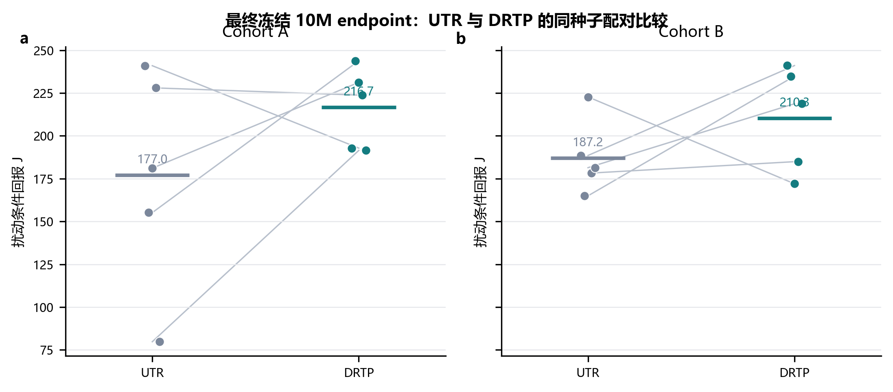
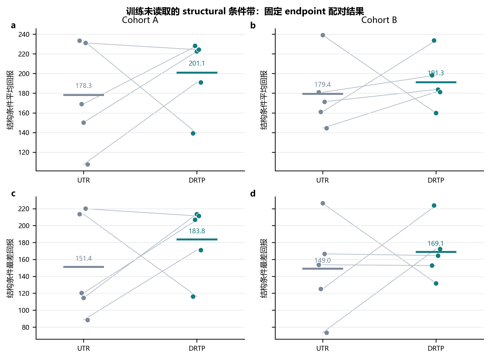
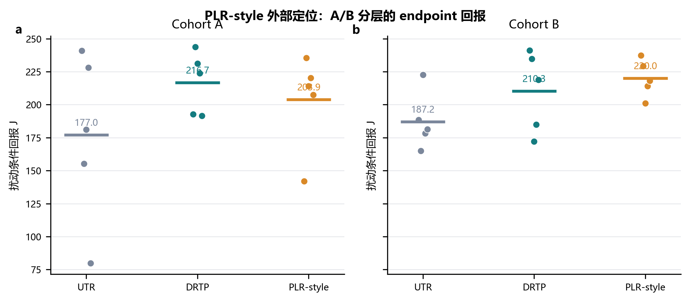
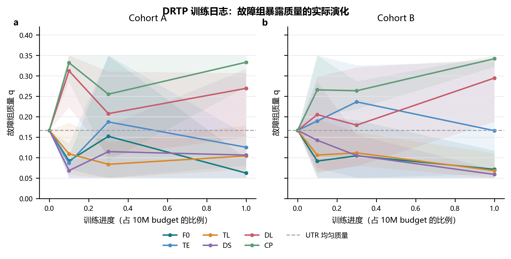

# 面向中继拓扑退化的异构多无人机协同训练暴露塑形

## 摘要

异构多无人机协同依赖目标感知、通信转发与任务支撑在角色之间形成连续的信息链。中继节点故障并不必然造成完全断联，却会改变攻击角色可合法使用的信息来源、缓存时效和协同路径，从而使训练阶段的拓扑暴露与执行阶段的结构性需求发生失配。本文研究这一训练暴露塑形问题：在策略主干、集中训练分散执行框架、PPO 目标、奖励、观测、动作、执行期信息边界、训练预算、名义工况暴露和故障支持集合均保持一致时，仅改变多个冻结故障组在 reset 阶段的采样分配，能否改善故障条件下的协同任务表现及其可靠性代价。为此，本文提出有界自适应拓扑扰动重加权方法（DRTP）。该方法以故障组回报相对名义工况的偏离构造训练期困难代理，周期性更新故障组采样质量，并以概率边界维持所有冻结组的持续覆盖。在两个相互独立、训练前冻结的 10M cohort 中，DRTP 相对参数量、条件集合和预算匹配的均匀拓扑随机化基线，扰动条件平均回报分别提高 39.64 和 23.15；正向配对种子数分别为 3/5 与 4/5。两个 cohort 中 DRTP 的观测最差种子和平均超时率均优于 UTR；A cohort 的碰撞率则由 0.003 升至 0.009，表明任务收益不能被直接等同为全面安全改进。本文据此将 DRTP 定位为一种在所评估中继拓扑故障条件下重复获得 cohort 级收益的训练暴露分配方法，而不主张每个训练种子均提升、一般分布鲁棒保证或执行期信息恢复。

## 关键词

异构多无人机；多智能体强化学习；通信拓扑退化；继电节点故障；训练暴露塑形；固定终点评价；训练种子

## 1 引言

### 1.1 中继拓扑退化是协同决策中的结构性问题

异构无人机编队通常由具有不同感知、通信和任务执行能力的平台共同完成任务。本文关注由侦察机、继电机和攻击机组成的三机协同系统：侦察机获取目标信息，继电机提供潜在的多跳通信支持，攻击机仅利用合法获得的信息形成攻击窗口。该任务的难点不只来自单机运动学，还来自信息能否沿合法的感知、通信和任务支撑关系传递。因此，协同策略面对的是一个随角色状态和空间几何变化的通信—任务图，而不是三个彼此独立的控制器。

继电节点故障对该图施加的是结构性扰动。故障窗口内，与继电机相关的通信关系会失效；在物理规则允许时，侦察机至攻击机的直接边仍可合法存在。由此，信息路径可能由“侦察机—继电机—攻击机”重构为“侦察机—攻击机”。研究问题并非在隐藏信息消失后恢复它，而是策略能否在合法信息路径和任务支撑关系改变后维持协同任务能力。

### 1.2 从故障多样性到训练暴露塑形

图结构多智能体强化学习、通信学习与鲁棒强化学习已经提供了关系建模、合法消息聚合和环境随机化的基础[2--5,17--21]。在多无人机通信网络中，节点失效也会改变可用转发路径与团队协同约束[15--16,27--30]。然而，单纯扩大故障条件集合并不回答一个训练分布问题：当多个故障组的当前任务难度不同，固定均匀随机化可能在相对容易的条件上重复消耗训练预算，而对更需要适应的结构性扰动暴露不足。

本文不把该问题包装为一般最坏情况优化，也不改变策略网络或执行期信息边界。相反，本文将可检验缺口限定为：在相同拓扑扰动支持、相同正常工况锚点和相同 PPO 学习器下，有界自适应故障组重加权是否会相对于均匀重加权改变故障任务表现及其可靠性权衡。这样的比较把方法差异限制在训练期 reset 条件的暴露分配，从而避免把容量、输入、奖励或任务接口差异误归因于采样器。

### 1.3 本文方法、证据问题与贡献

本文采用参数匹配的单图 MAPPO 作为共同策略主干。UTR 固定保留 50% 名义工况暴露，并在六个故障组间均匀分配其余质量；DRTP 保留完全相同的名义锚点和故障支持，仅依据故障组回报相对名义工况的偏离，周期性地在有界单纯形内更新权重。执行期 actor 不接收故障标签、全局拓扑真值、最短路或未来链路信息。

本文围绕以下问题组织证据。RQ1：在冻结的 UTR—DRTP 主比较中，自适应故障组暴露是否改善扰动任务端点？RQ2：任务增益是否伴随超时、碰撞或下尾表现的变化？RQ3：两个独立冻结 cohort 是否给出同方向的 cohort 级结论？RQ4：在训练未读取的预先冻结结构条件带上，结论的适用范围如何变化？RQ5：DRTP 与通用优先级式采样的关系如何定位？采样器遥测又能够证明什么，不能证明什么？

本文的贡献包括：

1. 将异构无人机中继故障定义为合法通信、信息路径和任务支撑关系的重构，并以严格执行期信息边界构造轻量 3DOF 协同任务；
2. 提出 DRTP，在不改变 actor、critic、PPO、奖励、观测、动作或故障支持集合的条件下，仅对冻结故障组实施有界自适应训练暴露分配；
3. 通过两个独立、训练前冻结的 10M cohort，以及源哈希可追溯的训练排除结构条件与 PLR-style 外部定位比较，分层报告平均回报、配对方向、下尾、超时和碰撞，从而给出 DRTP 相对于均匀暴露的受控经验边界。

## 2 相关工作

### 2.1 图结构多智能体强化学习

可学习通信、目标消息路由和注意力式通信为多智能体协同提供了多种关系表示与信息选择机制[17--21]。图注意力与拓扑感知策略梯度方法则可根据邻接关系聚合合法邻居信息[2--3]，并已用于多无人机协同搜索、跟踪和集群控制[6--7]。这些研究说明“使用图”本身不能构成本文的创新。本文固定同一个单图策略网络与价值网络，将研究焦点限定为拓扑扰动在训练期的分布方式。

### 2.2 鲁棒与分布变化下的多智能体学习

鲁棒 MARL 研究涵盖对手策略变化、环境动力学不确定性以及最坏情况优化等路线[4]，分布鲁棒 Q 学习则形式化了指定环境分布下的歧义集合[5]。组鲁棒优化、主动域随机化、课程、关卡回放、无监督环境设计和稳健 on-policy 采样分别研究最差组目标、环境参数采样、任务序列或采样数据分布[11--13,22--26]。DRTP 与这些思想存在明确知识继承关系，但贡献边界更窄：本文不建立一般 DRMDP 理论，不声称求得严格最坏情况策略，也不提供分布鲁棒保证；它只在冻结的六类拓扑扰动组上实现可复现的有界经验重加权。

### 2.3 通信受限与故障条件下的多无人机协同

现有无人机通信与 MARL 工作已围绕抗干扰通信、多跳中继、节点失效后的网络恢复，以及协同资源分配构建不同目标[8--9,27--30]。本文研究的输出不是通信吞吐量或网络连通度本身，而是中继节点故障引起路径与任务支持组成变化后，异构团队的任务得分和安全表现。因此，相关方法具有研究定位价值，但在动作空间、学习器、奖励和策略网络信息边界上并非可直接迁移的公平基线。

### 2.4 本文定位与对照边界

本文的核心经验比较是 UTR-SG-MAPPO 与 DRTP-SG-MAPPO。两者接触相同的七个训练组，具有相同参数量、PPO、环境、奖励、训练预算和配对评估样本带。该设计回答的是“在相同拓扑扰动集合上，自适应加权是否优于均匀加权”，而不是“DRTP 是否优于所有鲁棒 MARL”，也不回答“在线自适应是否优于任意固定非均匀分布”。

为补充同任务下的性能定位，本文还训练并评价了无图 MAPPO 性能参考（Non-Graph MAPPO Performance Reference，MAPPO-NoGraph）。该参考使用相同训练种子、10M 预算、环境、奖励和共同评价样本带，但移除了图消息输入，参数量为 35,771，与 UTR/DRTP 的 116,728 参数 SG 主干不同。因此，它只能回答该无图 MAPPO 参考在冻结任务中的性能位置，不能归因图结构、模型容量或 DRTP 自适应加权的单独作用。对 TAPE、M3DDPG 和相关无人机中继方法的审计表明，它们需要改变当前任务或学习合同，因而本文将其用于知识定位，不堆砌表面公平、实质不可比的对比方法。

## 3 问题建模

### 3.1 异构角色与 3DOF 环境

环境包含三架蓝方无人机和一个目标，蓝方角色依次为侦察机（智能体 0）、中继机（智能体 1）和攻击机（智能体 2）。仿真采用轻量三自由度（3DOF）运动学，时间步长为 1 s，最大时域为 260 步，水平空间半径为 50 km，高度范围为 1–9 km。每架蓝方无人机从 27 个离散动作中选择转向、爬升和加减速指令的组合。不同角色具有冻结的速度、加速度、转弯、爬升、雷达、通信和攻击几何参数。

每个策略网络（actor）的局部观测包含自身位置、速度、航向、航迹倾角、合法目标相对信息、探测状态、局部攻击窗口、能量、角色、入向连通度、消息时效和目标缓存置信度等 34 维特征。环境同时启用严格目标感知和智能体目标信息瓶颈：未探测目标且未合法接收新鲜缓存的智能体不能通过共享图获得真实目标状态。集中式价值网络（critic）仅用于集中训练分散执行（CTDE）[14]，不向策略网络增加执行期信息。

### 3.2 通信–任务图与合法信息边界

记时刻 (t) 的图为

\[
G_t=(V,E_t,X_t,Z_t),
\]

其中 (V) 包含三架 UAV 与目标节点，(X_t) 和 (Z_t) 分别表示节点和边特征。邻接矩阵采用 receiver-row 约定：

\[
A_t[i,j]=1
\]

表示接收方 (i) 当前能够合法使用来自发送方 (j) 的关系。感知边仅由冻结感知模型产生；通信边同时满足物理通信距离、节点状态和通信实现；任务支持边由已合法交付的信息与活跃任务支持状态产生，不构成额外隐藏信息通道。单图编码器使用这些合法关系的并集邻接矩阵，但策略网络不接收故障标签、最短路、未来链路或仿真器真实状态。

### 3.3 中继节点故障与路径重构

中继节点故障在冻结起始时刻 (t_f) 和持续时间 (d_f) 内禁用中继机的感知、发送与接收能力，并移除其相关通信边。典型故障 F0 定义为

\[
t_f=44,\qquad d_f=80.
\]

故障前，合法信息可能经“侦察机→中继机→攻击机”传递；故障后，若物理规则允许，“侦察机→攻击机”可继续作为合法直连路径。故障事件因此表现为

\[
0\rightarrow1\rightarrow2
\quad\longrightarrow\quad
0\rightarrow2,
\]

而不是必然的信息全失。本文将需要策略适应的对象定义为 communication-path composition、task-support source 和 coordination geometry 的变化。

**图1｜中继节点故障下的通信—任务路径重构与信息边界。** 中继相关通信关系在故障窗口内失效；若物理规则满足，侦察机至攻击机的直连仍可能合法。图中区分训练合同信息与执行期允许输入，避免将故障标签或全局拓扑真值注入策略网络。

### 3.4 正常工况、F0 与跨扰动条件

正常工况（nominal）不注入中继节点故障。除 F0 外，训练与正式评价覆盖以下扰动组：早期故障时机 `TE={(28,80),(36,80)}`、晚期故障时机 `TL={(52,80),(60,80)}`、短持续时间 `DS={(44,40),(44,60)}`、长持续时间 `DL={(44,100),(44,120)}` 和复合扰动 `CP={(28,120),(60,120)}`。括号分别表示故障起始时刻和持续时间。十个具体 onset--duration 成员同时属于训练 sampler 的组内均匀支持集和正式评价条件；正式配对评估样本带对全部方法和训练种子使用相同的 100 个基础 episode ID，并在 12 个条件间复用这些 ID，以减少场景差异对配对比较的干扰。

### 3.5 性能、安全与技术有效性 estimands

记某条件 (c) 下的平均 episode mission score 为 (J_c)。每个 episode 的 mission score 是三架蓝方无人机逐步奖励之和；它不是距离、时间或通信吞吐量等单一物理量。其共同部分奖励团队向目标接近、目标跟踪、攻击窗口、合法通信连通性及信息时效，并对其改善给予增量奖励；角色项分别奖励侦察发现、中继连通和攻击窗口，能量消耗、碰撞和约束违规施加惩罚，满足连续攻击窗口条件的任务完成给予终端奖励。因此，较高的 (J_c) 表示在既定奖励合同下更完整的“接近--信息支持--攻击窗口--完成”任务过程，但不能替代 success-at-horizon、超时、碰撞和约束违规等终局/安全指标。本文始终将这些指标并列报告。

本文报告

\[
J_{\mathrm{nominal}},\qquad J_{F0},
\]

以及十个跨扰动条件的

\[
J_{\mathrm{pert,mean}}=\frac{1}{10}\sum_{c\in\mathcal C_{\mathrm{pert}}}J_c,
\qquad
J_{\mathrm{pert,worst}}=\min_{c\in\mathcal C_{\mathrm{pert}}}J_c.
\]

其中 \(\mathcal C_{\mathrm{pert}}\) 为十个冻结的时机、持续时间和复合条件。它们的具体 onset--duration 成员已被训练 sampler 使用；因此 `J_pert,mean` 与 `J_pert,worst` 是跨扰动汇总指标，不是严格未见分布外（OOD）指标。为保持原始归档可追溯性，机器结果字段 `J_OOD_mean` 与 `J_OOD_worst` 分别映射到本文的 `J_pert,mean` 与 `J_pert,worst`。与之分开，本文还在结果冻结后一次性评价六个从训练支持集中排除的 onset--duration 成员；该评价是 post hoc 的附加未见条件证据，而非原始确认合同中的预注册 OOD 检验。

故障退化量定义为

\[
D_c=J_{\mathrm{nominal}}-J_c.
\]

方法间的同条件、同训练种子配对差值另记为

\[
\Delta J_c^{D-U}=J_c^{\mathrm{DRTP}}-J_c^{\mathrm{UTR}}.
\]

任务得分之外，本文报告碰撞率、超时率、约束违规率、episode 长度、故障触发前碰撞率和故障起始时刻存活比例。故障触发技术有效性只在计划故障起始时刻前仍存活的风险集 (R_c) 上计算：

\[
V_{\mathrm{trigger},c}=
\frac{\#\{\text{在 }R_c\text{ 中正确触发故障的 episodes}\}}
{|R_c|}.
\]

在故障起始时刻前因碰撞合法终止的 episode 不属于评估器缺陷，也不会从无条件任务得分或安全汇总中删除。

## 4 方法

### 4.1 参数匹配的单图 MAPPO

两种方法共用单图 MAPPO。对智能体 (i)，策略网络根据局部观测和合法图表示产生离散动作分布：

\[
a_{i,t}\sim\pi_\theta(a_{i,t}\mid o_{i,t},G_{i,t}).
\]

节点特征经线性编码后进入两层共享图注意力模块，图表示与本地观测表示融合后输出 27 维动作对数概率。集中式价值网络在训练期估计 (V_\phi(s_t))。训练使用标准裁剪 PPO 与广义优势估计（GAE）[10]：学习率 (3\times10^{-4})、折扣因子 0.99、GAE 系数 0.95、裁剪系数 0.2、熵系数 0.01、价值损失系数 0.5、最大梯度范数 0.5，每批执行 4 轮 PPO 更新。UTR 与 DRTP 的可训练参数量均为 116,728。

**图2｜UTR 与 DRTP 的训练分布差异和隔离变量。** 两种方法具有相同的策略网络、PPO、训练组、正常工况锚点、预算与评估协议；只有故障组权重由固定均匀分布或有界自适应规则产生不同。自适应器仅在训练期运行，不增加执行期参数或输入。

### 4.2 Uniform Topology Randomization

训练组集合为

\[
\mathcal G=\{N,F0,TE,TL,DS,DL,CP\}.
\]

UTR 固定正常工况采样质量：

\[
p_N=0.50.
\]

在故障组集合
\(
\mathcal F=\{F0,TE,TL,DS,DL,CP\}
\)
上采用条件均匀分布：

\[
q_k^{\mathrm{UTR}}=\frac{1}{6},\qquad
p_k^{\mathrm{UTR}}=(1-p_N)q_k^{\mathrm{UTR}}=\frac{1}{12}.
\]

组内两个 scenario member 再以相同概率采样。UTR 因而与 DRTP 接触完全相同的 topology-training universe。

### 4.3 DRTP 有界自适应拓扑扰动重加权

DRTP 是训练期的有界采样控制器，而不是一般 min--max 或分布鲁棒优化问题的求解器。它保持故障暴露总质量 \(1-p_N=0.50\) 不变，只在六个预定义故障组之间重新分配该质量；其可行权重集合为

\[
\mathcal Q=\left\{q\in\Delta^6:0.05\le q_k\le0.35\right\}.
\]

该采样器不改变 PPO 损失，也不近似求解一个可证明的内层对手分布。设第 (u) 个自适应边界前收集到组 (k) 的已完成 episode 平均回报为 \(\widehat J_{k,u}\)。若该组在窗口内被观测，则其指数移动平均（EMA）更新为

\[
\bar J_{k,u}=(1-\kappa)\bar J_{k,u-1}+\kappa\widehat J_{k,u};
\]

未观测组的 EMA 保持不变。Nominal EMA 采用相同规则。相对正常工况的性能缺口定义为

\[
d_{k,u}=\operatorname{clip}\!\left(
\frac{\bar J_{N,u}-\bar J_{k,u}}
{\max(|\bar J_{N,u}|,\epsilon)},0,d_{\max}
\right),
\]

并通过去均值得到中心化性能缺口

\[
\tilde d_{k,u}=d_{k,u}-\frac{1}{6}\sum_{j\in\mathcal F}d_{j,u}.
\]

指数重加权候选为

\[
\tilde q_{k,u+1}=
\frac{q_{k,u}\exp(\eta\tilde d_{k,u})}
{\sum_{j\in\mathcal F}q_{j,u}\exp(\eta\tilde d_{j,u})},
\]

最终权重经过平滑与有界单纯形投影：

\[
q_{u+1}=\Pi_{\mathcal Q}\left[(1-\beta)q_u+\beta\tilde q_{u+1}\right].
\]

这里的 \(\Pi_{\mathcal Q}\) 是对欧氏距离的有界单纯形投影，而不是逐元素截断后任意归一化。对待投影向量 \(x\)，实现寻找标量 \(\lambda\)，使

\[
q_k=\min\{0.35,\max\{0.05,x_k-\lambda\}\},
\qquad \sum_{k\in\mathcal F}q_k=1.
\]

实现以确定性有界单纯形投影求解 \(\lambda\)，并在数值容差内检查总质量和逐组边界。该程序只作用于训练期的六维采样权重，不涉及策略或价值网络参数、PPO 损失或执行期输入。完整数值实现、容差与可复现性检查见补充材料。

冻结超参数为：初始 (q_k=1/6)，前 128 updates 均匀 warm-up，之后每 32 updates 适配一次，\(\kappa=0.20\)、\(\eta=1.00\)、\(\beta=0.50\)、\(d_{\max}=2.00\)、\(\epsilon=10^{-8}\)。该更新受组鲁棒重加权和自适应域随机化的经验动机启发[11--12]，但本文仅检验它相对均匀采样的经验效果。

### 4.4 Nominal competence anchor

DRTP 中存在两种不同的锚点。第一，(p_N=0.50) 固定正常工况暴露比例，避免自适应器将全部训练质量转移到故障条件。第二，\(\bar J_N\) 作为任务能力参照，使性能缺口表示某故障组相对正常工况的任务差距。二者均属于训练采样器，不是辅助损失，也不进入策略网络或价值网络。

### 4.5 训练流程、复杂度与信息边界

每次环境重置时，采样器先以 0.5 概率选择正常工况；否则根据 (q) 选择故障组，再在组内均匀选择故障起始时刻和持续时间。UTR 的 (q) 固定，DRTP 的 (q) 仅在自适应边界更新。组标签、故障起始时刻、持续时间、EMA、性能缺口和 (q) 只存在于训练记录和日志中。评价阶段不实例化自适应采样器。

DRTP 不增加 trainable parameter，也不改变 inference graph。其附加计算来自按组累计 episode return、EMA 更新和六维有界投影；因此论文只主张“参数量相同且无 inference-time 模块”，不在缺少共同硬件日志的情况下声称 wall-clock 或显存优势。

### 4.6 有界重加权的干预对象与稳定性含义

DRTP 的更新对象是环境 reset 时“下一段经验来自哪一个故障组”的概率，而不是某一段既有 trajectory 的损失权重。这个区别决定了方法的解释范围。PPO 在已收集 rollout 上仍按照共同的优势估计、裁剪目标和小批次更新规则优化；DRTP 只改变未来 rollout 中各组出现的相对频率。因而它不会改变同一 episode 内的奖励归属、动作可行集或图消息掩码，也不会对已采集的经验施加事后重标记。对 UTR 与 DRTP 而言，单个故障组内 scenario member 的生成规则也保持一致，变化发生在六组之间的预算分配层。

有界约束使这种干预具备两个互补性质。其一，任何已经注册的故障组始终具有正的暴露概率，因此困难估计短暂变低并不会使其从训练支持中消失。其二，任何单一组的概率均受上界限制，故一次局部估计波动不会将所有故障经验集中到该组。结合固定的 nominal 质量，采样器维持“正常任务能力—多组故障覆盖—困难组侧重”三者之间的受限平衡。这里的稳定性指采样分布的可行性和覆盖性，不是对训练回报方差、最坏案例或安全约束的理论保证。

从优化角度看，DRTP 也不同于以最大化最差组回报为目标的群组鲁棒优化。后者通常把每一组的性能直接纳入外层 min--max 或分布不确定集；DRTP 没有改变策略目标函数，也没有为任一组设置硬约束。它以名义相对回报缺口构造一个训练期代理，并通过平滑、中心化和有界投影形成下一窗口的暴露质量。这个设计更接近有限课程库内的自适应经验安排：它可以改变某些故障组被练习的程度，但最终是否带来端点收益必须由冻结 endpoint 评价决定，而不能从更新公式本身推出。

### 4.7 名义相对困难代理的作用、局限与可审计性

选择名义相对回报而不是某一故障组的绝对回报作为代理，源于本任务中训练过程会同时经历总体能力上升和不同故障条件间表现差异的事实。若只按绝对回报排序，早期所有组都可能由于策略尚未学会基础协同而被视为同样困难；若只按当前损失或梯度范数排序，又会把学习器内部尺度引入环境组间分配。相对 nominal 的缺口将问题表达为：在同一阶段已经形成的基础任务能力下，哪一类故障条件仍表现出更明显的协同代价。它并不宣称是拓扑难度的物理真值，而是一个对训练暴露控制有用、可由日志复算的代理。

该代理被中心化后进入指数更新，意味着组质量取决于相对于其他组的当前差距，而不是对所有组同时发生的整体回报平移。EMA 使单个窗口中 episode 数量的偶然波动不会立即转为大幅概率变化；平滑参数进一步限制连续更新的速度。上述实现细节在方法上重要，因为它们明确了 DRTP 的可重复定义：任何复现都应能从组级完成 episode、名义锚点和冻结超参数重新生成相同的 q 演化，而不需要访问策略的隐藏表示或人工判断某个训练曲线“看起来困难”。

日志可审计不等于机制已被完全识别。若某一组最终具有更高质量，它至少表明采样器按定义对该组投入了更多训练暴露；它并不单独证明该组的图论退化程度更大、策略在该组学得了某种特定通信技巧，或该质量变化是最终回报差的唯一原因。完整的机制拆分需要保持相同训练合同下的语义置换、固定质量和自适应质量的析因对照。本文把这一要求明确保留为后续证据路径，避免将一个可验证的训练事实改写为尚未观察到的策略因果过程。

## 5 最终冻结实验设计与证据分层

### 5.1 受控比较及唯一干预

本文的主要比较是 UTR-SG-MAPPO 与 DRTP-SG-MAPPO。在两种训练臂之间，单图 actor/critic、PPO 目标与超参数、奖励、局部观测、动作接口、执行期信息边界、环境转移、训练预算、名义工况质量和六类故障组支持集合均保持不变；唯一改变的是 reset 阶段六个冻结故障组之间的训练暴露质量。UTR 对六组采用均匀质量，DRTP 以训练期的名义相对困难代理周期性更新有界质量。因而该比较识别的是“有界自适应故障组暴露相对于均匀故障组暴露”的合同内增量，不是不同网络容量、不同输入信息或不同奖励塑形的比较。

每条轨迹从零开始训练至预先指定的 10M endpoint。最终 checkpoint 是唯一允许进入正式评估的检查点；训练过程的里程碑仅服务于恢复和训练日志，不参与性能驱动的 checkpoint 晋升、种子排除、提前停止或追加重跑。每个 cohort 内 UTR 与 DRTP 使用同一训练 seed 形成配对，但训练种子是唯一独立统计单位，不能把同一策略的多个条件或 episode 计为额外训练重复。

**表1｜本文证据层级与可回答问题。**

| 层级 | 证据对象 | 证据角色 | 允许的结论上限 |
|---|---|---|---|
| 最终冻结主比较 | A（78011--78015）和 B（78021--78025）的 UTR--DRTP 配对 endpoint | 主要受控比较 | 两个独立 cohort 中的 cohort 级结果与可靠性权衡 |
| 训练未读取 structural 条件带 | 固定 A/B checkpoint 的预先冻结 held-out tape | 分层泛化支撑 | 对该明确条件带的 endpoint 表现，非一般 OOD 保证 |
| PLR-style 比较 | 匹配预算的外部优先级式训练臂 | 外部定位 | 相同任务下的性能位置与回报--可靠性权衡，非主因果对照 |
| sampler 日志 | 10 条最终 DRTP 训练轨迹 | 实施与机制描述 | 训练暴露确已偏离均匀分配，非内部策略机制的因果证明 |
| 历史开发和早期队列 | 其他种子、其他协议或其他候选方法 | 来源追溯背景 | 不参与本文样本量、主表或主结论 |

### 5.2 双 cohort、固定 endpoint 与评估带

最终 A cohort 使用训练种子 78011--78015，B cohort 使用 78021--78025。两批训练种子、训练过程与 endpoint tape 相互独立；A/B 分层报告，任何 n=10 汇总仅可作描述性展示，不可替代两批分别成立的证据。评价在训练前冻结的名义与故障条件带上执行，记录原始 episode 指标并汇总为每个训练 seed 的 endpoint。当前主文将训练支持内的扰动条件称为“扰动条件”，而不把它们误称为 OOD。

为避免将后续资产与主比较混淆，训练完成后另对固定 A/B endpoint 执行训练未读取的 held-out tape。其 primary structural 条件带包含 Scout 节点故障、对称最长边删除、有向最长边删除以及 Scout 节点故障与边删除的复合；仅改变 relay 故障时机或时长的 parameter 条件只作诊断，不承担结构泛化结论。该 held-out 评价不重新训练、不选择 checkpoint，也不产生新的训练重复。

**表2｜冻结任务、策略接口与训练设置。**

| 类别 | 固定设置 |
|---|---|
| 任务实体 | 三架异构蓝方 UAV（Scout、Relay、Attacker）与一个目标 |
| 动力学与时域 | 轻量 3DOF；1 s 时间步；最大 260 步 |
| 执行期输入 | 本地状态、合法目标信息、合法图关系、缓存时效与任务支持状态；不输入故障标签或未来链路 |
| 动作空间 | 每架 UAV 从 27 个离散转向、爬升和加减速组合中选择动作 |
| 学习器 | 相同单图 MAPPO、CTDE、PPO 目标、网络参数量、奖励与训练预算 |
| 唯一方法差异 | reset 阶段六个冻结故障组的暴露质量：UTR 固定均匀；DRTP 有界自适应 |

**表3｜UTR 与 DRTP 的受控变量关系。**

| 项目 | UTR | DRTP | 是否构成方法差异 |
|---|---|---|---|
| actor/critic、PPO、奖励、观测、动作 | 相同 | 相同 | 否 |
| 名义工况质量 | 0.50 | 0.50 | 否 |
| 故障组支持集合与成员 | 相同 | 相同 | 否 |
| 故障组内成员采样 | 相同冻结规则 | 相同冻结规则 | 否 |
| 故障组间质量 | 六组均匀 | 基于名义相对困难的有界更新 | 是 |
| 执行期故障标签/隐藏信息 | 不输入 | 不输入 | 否 |

**表4｜训练条件组和报告端点的语义。**

| 对象 | 定义或角色 | 本文中允许的解释 |
|---|---|---|
| Nominal | 无 relay 故障的锚点工况 | 名义能力保持与困难代理的参考 |
| F0 | 典型 relay 故障（冻结 onset/duration） | 典型故障端点 |
| TE/TL | 较早/较晚 onset 的故障成员 | 训练支持内的时机扰动 |
| DS/DL | 较短/较长 duration 的故障成员 | 训练支持内的持续时间扰动 |
| CP | onset 和 duration 的复合故障成员 | 训练支持内的复合扰动 |
| \(J_{\mathrm{perturbed}}\) | 六个故障组端点的聚合任务回报 | 主要任务端点，不自动等同安全 |
| success/timeout/collision | 终局行为端点 | 与回报并列解释，不可互相替代 |

### 5.3 端点、统计单位与可靠性解释

主任务端点为每个训练 seed 的扰动条件平均任务回报 \(J_{\mathrm{perturbed}}\)。同时报告中位数、观测最差训练 seed、样本标准差及同 seed 的 DRTP--UTR 差，以区分中心趋势、离散度和下尾行为。成功率、超时率和碰撞率是独立的终局指标：较高回报不自动代表更安全，较低碰撞也不自动代表任务更优。本文不以 episode 数量构造训练重复的 p 值，也不将训练种子较少的描述性结果包装为逐 seed 保证。

正式解释遵循以下顺序：先看 A/B 分层的 UTR--DRTP 主比较，再看配对方向、下尾与成功/超时/碰撞的权衡；随后将 structural 条件带与 PLR-style 作为边界清楚的支撑性证据。旧 6-UAV v1 因故障注入发生在大量 episode 终止后而永久排除。修复后的 fault-step=3 6-UAV v2 已完成训练、固定 endpoint 与故障触发审计，但其评价出现 UTR 全条件满分的天花板效应，且 DRTP 有一条训练 seed 全部超时；它因此不能回答跨规模的相对性能问题，也不进入本文跨规模结论。全因子消融和统一硬件的运行开销仍须在各自结果、原始记录和合同审计完成后才可进入本文结论。

### 5.4 可复现性、检查点与排除规则

所有正式结果均由保存的最终 checkpoint、评价 manifest、逐 episode 原始指标、逐 seed 汇总和诊断报告组成可追溯链。训练与评估之间不允许依据回报替换 checkpoint；同一 cohort 内方法间使用共同的冻结 endpoint 规则。若某个历史试验的环境、故障时机、种子队列、算法臂或评价协议与最终 A/B 合同不一致，则它只能保留在归档中，不能通过改名、拼接或合并而成为本文的正式证据。

### 5.5 从任务语义到训练暴露的实验闭环

本研究的实验设计从一个具体的协同失配出发，而不是从“提高某项平均分数”出发。侦察机、Relay 与攻击机在任务中承担不同但互补的感知、转发与攻击支撑职责。Relay 故障使原有信息链的一部分失效，并要求策略在仍然合法的直连边、缓存与局部观测条件下继续完成团队协同。由此，故障条件之间并非只是随机编号不同：它们在故障开始时刻、持续时间、任务阶段和可用路径组合上产生不同的训练压力。若训练过程对每一类条件投入完全相同的预算，策略可能对某些重复出现、但适应需求较低的条件投入过多更新，而对需要更多适应的条件获得不足暴露。

DRTP 的实验价值正是将这一判断转化为可反驳的干预。它不增加新的观测，不向 actor 提供环境故障标签，也不改变所有方法所能访问的拓扑、状态或动作；若 DRTP 相对 UTR 出现差异，合理归因范围仅限于训练中同一故障支持集合的曝光顺序与频率已被改变。反过来，若两者没有系统差异，也不能把环境难度、网络容量或奖励实现归因于 DRTP。本设计因此把“拓扑退化是否值得被训练分布显式塑形”收束为一个受控的经验问题。

实验还区分训练时暴露和执行时适应两个层次。DRTP 在训练过程中根据历史回报统计更新故障组质量；最终策略在执行时不运行 sampler，也不获得额外的故障说明或隐藏全局状态。本文报告的端点增益因而不能被表述为在线诊断、动态通信恢复或额外信息获取的效果。它反映的是：在固定执行接口下，不同训练暴露安排可能形成不同的策略参数与协同习惯。

### 5.6 评价合同的公平性与端点组织

固定 endpoint 评价的目的不是从训练曲线中挑选最佳时刻，而是让所有方法在同一预算完成后面对同一类任务。每个训练 seed 的汇总首先在条件和 episode 层面计算，再压缩到一个可配对的训练 seed 端点。这样，条件内的 episode 用于降低该 seed 的评价噪声，而 cohort 内的五个训练 seed 才承担方法比较的独立性。A/B 的分别报告进一步避免了“将第二批训练仅作为额外样本而忽略其自身方向”的做法。

本文的结果组织与该合同保持一致。第一层报告任务端点：扰动条件平均回报、中心趋势与下尾。第二层报告终局行为：成功、超时与碰撞。第三层报告支撑性情境：训练未读取的 structural 条件带和外部 PLR-style 位置。第四层报告实施遥测：故障组质量的实际演化。每层都回答不同的问题；将任何一层替换为另一层，都会改变主张的含义。例如，sampler 发生非均匀变化不能代替主端点表现，外部比较的排序也不能代替 UTR--DRTP 的受控因果对照。

### 5.7 研究问题、端点与证据映射

**表5｜研究问题与证据映射。**

| 研究问题 | 核心证据 | 主要端点 | 结论边界 |
|---|---|---|---|
| RQ1：自适应暴露是否改变故障任务表现？ | 最终 A/B UTR--DRTP 配对 | \(J_{\mathrm{perturbed}}\)、中位数、最差 seed、配对方向 | 仅针对冻结三 UAV 合同与均匀对照 |
| RQ2：任务收益伴随何种可靠性权衡？ | 最终 A/B 原始 endpoint 汇总 | success、timeout、collision | 不将回报提升外推为全面安全优势 |
| RQ3：训练分布是否确已改变？ | sampler 日志 | 组质量 \(q\)、选择计数、里程碑演化 | 不单独识别策略内部因果机制 |
| RQ4：训练外结构条件带如何表现？ | held-out structural tape | structural mean 与 worst、终局行为 | 仅覆盖预先冻结的条件带 |
| RQ5：与通用 priority 的关系？ | PLR-style 外部臂 | 分层回报、success/timeout | 外部定位，非容量/结构完全等价的主消融 |

### 5.8 评价带的构造原则与条件层级

本文使用条件带而非单个故障点来评价策略，是因为 Relay 故障的任务影响取决于其发生阶段与持续时间。F0 提供固定的典型故障端点；TE/TL 与 DS/DL 分别改变 onset 和 duration；CP 则保留二者同时变化的复合情境。它们共同构成训练支持内的扰动带，所有主方法在训练时均访问相同的成员集合。报告聚合端点时，条件带的作用是描述一个训练策略在注册扰动家族上的整体响应，而非把某一条件的较高分数推广为所有故障模式的结论。

训练后 structural 条件带采用不同的组织逻辑。其成员通过 Scout 节点故障、对称最长边删除、有向最长边删除和复合变化来改变任务图中可用路径的组成，而不是只在原有 onset--duration 轴上微调参数。该带在训练期间未被 sampler 读取，故可用于观察模型在明确列出的结构组合上的表现。它仍然是有限的、由研究者预先写入 tape 的评价宇宙：论文的严谨性来自“该条件带被固定且训练未读取”，而不来自把任何未见情境统称为 OOD。

这种层级化设计也保护了比较的可解释性。若把训练支持内的参数扰动、训练未读取的结构带和早期探索性条件混在同一平均数中，读者将无法判断增益来自何种条件集，后续复现也无法确定应使用哪个 tape。本文因此将主扰动带、structural 条件带、外部 comparator 和历史资产分别放入不同表格与图形；它们不是重复汇报同一个结果，而是在不同证据角色下回答不同的经验问题。

### 5.9 审计链、来源一致性与主文纳入规则

每一个进入主文的数字都应完成三次连接。第一，训练记录必须连接到明确的 arm、训练 seed、最终 checkpoint 和运行配置，以确认方法标签与训练预算。第二，评价记录必须连接到该 checkpoint、冻结 tape 和逐 episode 原始指标，以确认评价条件及终局指标的来源。第三，汇总记录必须保留从条件/episode 到训练 seed、从训练 seed 到 cohort 的聚合规则，以确认图表的独立单位与数值口径。这条链的功能不是制造额外的实验数量，而是使每个主张可被反向追溯。

来源一致性对于长期演变的研究工程尤其重要。不同阶段可能使用相同或相近的方法名称，却对应不同的故障时机、策略接口、训练预算、种子注册表和 endpoint 规则。因而“都叫 DRTP”不能构成将多个队列合并为正式重复的理由。本文只接受与最终 A/B 合同一致的资产进入核心表格；相近但不一致的资产保留在仓库和实验日志中，用于理解项目演变或定位未来修复，而不会改变本文的样本量、均值或结论方向。

主文的纳入规则还限定了扩展资产的处理方式。6-UAV v2 已具备完整的 checkpoint、原始 endpoint、汇总表和故障触发审计，但 endpoint 的 UTR 天花板效应使其缺少区分训练分配方法的测量灵敏度，故不以“技术上成功完成”之名提前写成跨规模结果。析因消融与开销测量也只有在满足固定 checkpoint、冻结评价、来源可追溯及端点可判别性后，才分别回答组件必要性和工程代价问题。该规则使论文的当前结论与后续扩展相互兼容，而不需要在结果完成后回溯性调整主比较。

### 5.10 配对设计、cohort 分层与结果可读性

同一 cohort 内，UTR 与 DRTP 按共同的训练 seed 配对并不意味着两种方法共享训练轨迹；每一条轨迹仍从独立初始化开始，在各自采样规则下完成完整预算。配对的作用是使比较更聚焦于同一随机起点下的相对差异，而不是将 seed 编号本身视为可学习的信息。图4中的每一根连接线均对应这样一个同 seed endpoint 对；连线向上表示该 seed 上 DRTP 的扰动端点更高，连线向下则保留为同等可见的观测事实。

cohort 分层进一步回答了“这一现象是否只发生在一个初始化集合中”的问题。A 与 B 使用不重叠训练 seed，并在相同的最终合同、终点评价和汇总规则下独立运行。主文分别给出两批的均值、配对方向和可靠性端点，而不是通过合并条件数或 episode 数把它们化成一个表面更大的样本。这样的呈现让读者既能看到两批的重复正向任务端点，也能检查每一批内部仍存在的训练差异。

对审阅者而言，这一组织方式还使不同图表具有明确的阅读顺序：先读表6的绝对回报，再读图4和表7的 seed 级方向与下尾，再读表8的成功、超时和碰撞。若只使用 cohort 平均回报，少数异常运行可能被隐藏；若只使用单一最差值，则中心趋势又会被忽略。三者并列并不是为了增加指标数量，而是为了将“典型表现”“已观察到的下尾”和“终局行为组成”放在相同证据层级下解释。

### 5.11 执行期信息边界与公平比较的含义

通信拓扑退化问题容易把两类能力混在一起：一类是在既定信息边界下学会在可用路径、局部观测和缓存信息之间协调；另一类是向策略额外提供故障标签、完整拓扑或未来事件，以便其直接识别环境状态。本文研究前者。无论 UTR 还是 DRTP，actor 在执行期都不接收故障组编号，critic 的训练期集中信息也不回流为执行期的隐藏输入。两种方法都必须在相同的合法关系图上决策，故障对可用信息路径的影响不会因方法标签而被绕过。

这一定义还说明了为何训练期 sampler 日志不能作为策略输入。采样器可以在训练阶段利用分组统计安排下一次 reset，却不参与单步动作推理；最终 checkpoint 只包含共同的策略与价值网络接口。因而，主比较排除了“DRTP 在测试时获得更多情境信息”这种解释，使观察到的端点差异能够被限定为训练分布的长期影响。与此同时，论文也不会把这种训练期塑形误写成在线网络重构、故障诊断或显式通信协议学习。

在固定信息边界下保持变量一致，是使外部比较可被正确阅读的前提。UTR--DRTP 主比较隔离的是采样质量；PLR-style 则用于展示相邻的优先级式训练安排在相同任务中的位置。若某个未来基线改变了网络容量、图输入、故障可见性或动作接口，它可以服务于系统性能定位，却不能被纳入本文“唯一变化项”的因果表述。这样的区分让论文既能讨论更广泛的相关方法，也不会牺牲主比较的解释清晰度。

## 6 双 cohort 受控结果

### 6.0 先验证任务干预，再解释端点差异

结果分析首先依赖环境合同而非回报排序。Relay 故障改变的是角色之间可使用的信息与任务支撑路径，而不是对策略额外开放故障标签或全局状态。故障组的定义、名义锚点和执行期信息屏蔽在 UTR 与 DRTP 之间完全一致；因此，主比较的含义不是“哪一种网络看到更多信息”，而是同一策略接口在不同训练暴露分配下最终形成的差异。该前提使后续的 A/B endpoint 比较具有明确的干预对象，也要求本文避免把任何结果改写为执行期的通信恢复能力。

在解释端点前，还应区分两种变异来源。训练 seed 影响从随机初始化、环境采样和优化轨迹中积累的差异；评价 episode 则是在一个既定训练 seed 下对固定条件带的任务重复。图4中的五个点因此不是“少量 episode”，而是五个独立训练过程的最终摘要。图中的连线对同一 seed 配对，既展示 DRTP 的收益并非只由 cohort 均值掩盖，也暴露了个别训练初始化仍可能得到不利差值。这样的呈现比仅报告汇总均值更接近本问题的可靠性结构。

### 6.1 两个冻结 cohort 中均观察到更高的扰动任务回报

表6给出 UTR 与 DRTP 的绝对 endpoint。A cohort 中，DRTP 的平均扰动回报为 216.66，高于 UTR 的 177.02；B cohort 中，对应数值为 210.34 与 187.18。以同一训练 seed 配对后，DRTP 相对 UTR 的 cohort 平均差分别为 +39.64 和 +23.15。两批的独立重复方向因此支持“在所评估冻结合同下的 cohort 级扰动任务收益”，而不是由单一有利训练队列支撑的结论。

**表6｜最终冻结 A/B cohort 的 UTR 与 DRTP 扰动端点。** 数值为五个独立训练种子的汇总；标准差为样本标准差。

| Cohort | 方法 | J_perturbed 均值 | 中位数 | 最差 seed | 样本 SD | 成功率 | 超时率 | 碰撞率 |
|---|---|---:|---:|---:|---:|---:|---:|---:|
| A | UTR | 177.02 | 181.12 | 79.75 | 64.53 | 0.267 | 0.730 | 0.003 |
| A | DRTP | 216.66 | 223.82 | 191.49 | 23.48 | 0.394 | 0.597 | 0.009 |
| B | UTR | 187.18 | 181.42 | 164.98 | 21.66 | 0.289 | 0.711 | 0.000 |
| B | DRTP | 210.34 | 218.78 | 172.03 | 30.54 | 0.398 | 0.602 | 0.000 |

**图4｜最终冻结 10M endpoint 的同训练种子配对结果。** a，A cohort；b，B cohort。点表示独立训练 seed 的扰动条件回报，灰线连接同一 seed 的 UTR 与 DRTP endpoint，短横线为 cohort 均值（每面板 n=5）。该图展示配对方向及离散性，不将五个 seed 的 episode 轨迹视为额外独立样本，也不表示显著性检验。

### 6.2 配对方向与下尾表现共同限定结果解释

平均值不应替代逐 seed 检查。A 中 DRTP 的扰动回报在 3/5 个配对 seed 中为正，B 中为 4/5 个配对 seed 为正。尽管 A 未达到逐 seed 单调获益，DRTP 的观测最差 seed 在两批中均高于 UTR：A 为 191.49 对 79.75，B 为 172.03 对 164.98。该模式说明本文的主要证据并非仅由上尾偶然值驱动；但 3/5 与 4/5 也明确要求避免“每个 seed 均提升”的表述。

**表7｜主比较的 cohort 级配对与下尾摘要。**

| Cohort | DRTP−UTR 的平均 ΔJ_perturbed | 正向配对 seed | DRTP 最差 seed−UTR 最差 seed | 允许的解释 |
|---|---:|---:|---:|---|
| A | +39.64 | 3/5 | +111.73 | cohort 级中心趋势和观测下尾均有利 |
| B | +23.15 | 4/5 | +7.05 | 独立 cohort 中仍为正向，但优势幅度较小 |

### 6.3 任务收益与终局行为并非同一指标

在两个 cohort 中，DRTP 的平均成功率均高于 UTR，超时率均更低。A cohort 的碰撞率从 0.003 上升至 0.009；B cohort 两种方法的平均碰撞率均为 0。因此，回报和 timeout 的改善不能被改写为“全面安全提升”。本文将更准确地把结果描述为：在本任务奖励与终止合同下，DRTP 的较高扰动回报与更高成功率、较低超时相伴出现，但碰撞端点需要独立阅读。

**表8｜主比较的任务端点与终局行为应分层阅读。** 均值在 cohort 内按五个训练 seed 汇总。

| Cohort | 方法 | 成功率 | 超时率 | 碰撞率 | 对任务回报的正确解释 |
|---|---|---:|---:|---:|---|
| A | UTR | 0.267 | 0.730 | 0.003 | 主比较基线 |
| A | DRTP | 0.394 | 0.597 | 0.009 | 成功/超时有利，但碰撞不完全同向 |
| B | UTR | 0.289 | 0.711 | 0.000 | 独立 cohort 基线 |
| B | DRTP | 0.398 | 0.602 | 0.000 | 成功/超时有利，碰撞持平 |

### 6.3a 回报、下尾与终局行为构成同一证据链的不同侧面

在本任务中，较低的超时率通常意味着团队更常在固定时域内达成可用的协同状态；但它并不排除碰撞或其他终局路径发生变化。A cohort 中 DRTP 的碰撞率小幅高于 UTR，正说明单一回报端点不能覆盖所有可靠性含义。相对地，B cohort 的碰撞率持平而 success/timeout 方向有利，说明同一训练分布干预在不同初始化集合上的终局组合仍需分层解释。表8将这些端点并列，使任务收益、下尾表现与安全相关端点都可被审阅，而不是由一个综合得分取代。

下尾的角色同样需要准确界定。A/B 中 DRTP 的观测最差训练 seed 均高于对应 UTR 的最差 seed，这支持“优势不完全由少数特别高的 DRTP 运行驱动”的描述；但观察到的最小值不是严格最坏情况风险估计，也不能推出后续任一训练 seed 都不会失败。本文因此把它用于刻画已观察到的 cohort 内可靠性形态，而不将其提升为分布鲁棒保证。

### 6.4 训练排除的结构条件带提供了有限的泛化支撑

主比较的七个条件属于训练支持集合，因而不能被重命名为严格 OOD。为检验结果是否仅限于这一支持集合，研究在训练完成后针对两批冻结 10M checkpoint 执行训练未读取的 held-out tape；该 tape 在运行前冻结，不参与重新训练或 checkpoint 选择。其 primary structural 条件包括 Scout 节点故障、对称最长边删除、有向最长边删除及 Scout 节点故障与边删除的复合；两个仅改变 relay 故障时机或时长的 parameter 条件被保留作诊断，不被作为 structural OOD 结论的依据。

表9显示，在四个预先冻结的 structural 条件聚合上，DRTP 相对 UTR 的 cohort 平均回报差在 A/B 中分别为 +22.77 与 +11.96；按每个训练 seed 的最差 structural 条件汇总后，差值分别为 +32.48 与 +20.03。这些结果将主比较的结论延伸到所定义的训练排除结构条件带，但仍不足以证明对任意未见拓扑的普适泛化。可靠性端点也并非完全同向：A 中 DRTP 的 structural timeout 更低，而 B 中 timeout 更高、collision 更低。因此，该部分的正确定位是预先冻结条件带上的分层经验支持，而不是新的训练重复或一般化保证。

**表9｜训练排除 structural 条件带上的固定 endpoint 汇总。** 所有数值均按 cohort 内五个训练 seed 汇总；`J worst` 是每个 seed 在四个 structural 条件中最低回报后再作 cohort 汇总，不能按 episode 解释为独立重复。

| Cohort | 方法 | structural J mean | structural J worst | structural timeout | structural collision |
|---|---|---:|---:|---:|---:|
| A | UTR | 178.31 | 151.35 | 0.748 | 0.0030 |
| A | DRTP | 201.08 | 183.83 | 0.647 | 0.0055 |
| B | UTR | 179.38 | 149.03 | 0.628 | 0.0015 |
| B | DRTP | 191.34 | 169.06 | 0.689 | 0.0000 |

**图5｜训练未读取 structural 条件带上的固定 endpoint 配对结果。** a--b 为四个 structural 条件聚合后的平均回报，c--d 为每个训练 seed 的最低 structural 条件回报；A/B 分层显示。点和配对线均以训练 seed 为单位，短横线为 cohort 均值（每面板 n=5）。结果仅覆盖该冻结条件带，不能外推为任意未见拓扑的普适泛化。

### 6.4a 结构条件带检验的是外推范围，而非额外样本量

held-out structural 评价的价值在于改变了训练中未读取的结构条件，而保持已完成训练的 checkpoint 不动。该设计使问题从“DRTP 是否在已训练支持内表现较好”转为“这种训练暴露塑形是否在明确指定的结构变化带上仍呈现有利端点”。A/B 中回报平均值和按 seed 汇总的最差 structural 条件均具有正差，为主比较提供了边界清楚的补充；与此同时，B cohort 的 structural timeout 不再保持有利方向，说明该证据不应被浓缩为单句的泛化或可靠性保证。

需要强调的是，structural 条件带并没有把训练种子数量从五扩展为更多独立训练重复。四种结构条件提供的是同一训练策略在多个固定测试情境下的响应剖面。其作用是限定结论在何种结构变化范围内获得支撑，而不是通过叠加 episode 或条件数来放大统计确定性。

### 6.5 与 PLR-style 外部比较的定位：竞争性而非全面支配

PLR-style 采用与 A/B 对应的训练种子、10M 预算、任务环境、网络维度和 PPO 超参数从零开始训练；它是定位“通用优先级式暴露调整”而非替代主要因果对照的外部比较。表10中，A cohort 的 DRTP 平均扰动回报为 216.66，高于 PLR-style 的 203.87，且 DRTP timeout 更低；B cohort 则由 PLR-style 获得更高的平均扰动回报（220.03 对 210.34），同时 DRTP 的 success 更高、timeout 更低。由此，证据并不支持 DRTP 对通用 prioritization 的跨 cohort 全面支配；它支持的是 DRTP 在这一外部比较中具有竞争力，并呈现由拓扑语义暴露和通用优先级各自可能影响的性能—可靠性权衡。

**表10｜PLR-style 外部定位比较。** A/B 分层报告；UTR 与 DRTP 为原始冻结 endpoint，PLR-style 为匹配预算下从零训练的外部比较臂。

| Cohort | 方法 | J_perturbed 均值 | 中位数 | 最差 seed | 超时率 | 碰撞率 |
|---|---|---:|---:|---:|---:|---:|
| A | DRTP | 216.66 | 223.82 | 191.49 | 0.597 | 0.009 |
| A | PLR-style | 203.87 | 214.02 | 142.02 | 0.742 | 0.014 |
| B | DRTP | 210.34 | 218.78 | 172.03 | 0.602 | 0.000 |
| B | PLR-style | 220.03 | 218.22 | 201.06 | 0.699 | 0.000 |

**图6｜PLR-style 外部定位的 A/B 分层 endpoint。** 点表示训练 seed 的扰动条件回报，短横线为 cohort 均值（每种方法、每个 cohort 均为 n=5）。该图用于比较相同预算下的结果位置；由于 PLR-style 并非本文主受控比较的唯一变量对照，不能由此识别拓扑语义本身的因果效应。

### 6.5a 外部 PLR-style 结果用于定位机制，而不取代主对照

通用优先级式训练也可能将更多学习机会分配给当前较困难或较有价值的情境，因此 PLR-style 的存在对于解释 DRTP 至关重要。A cohort 中 DRTP 的平均回报和 timeout 位置更有利；B cohort 中 PLR-style 的平均回报更高，而 DRTP 保持更高的成功率和更低的超时率。这个交叉排序具有实质信息：它不支持“只要使用 topology-aware 规则就会在所有队列全面压倒 generic priority”的叙事；同时也不否定 DRTP 在两个正式 cohort 相对 UTR 的受控增量。

因此，PLR-style 最适合回答“DRTP 在相邻机制空间中的性能位置是什么”，而不是回答“拓扑语义是否被唯一地因果证明”。后一个问题需要完整的语义置换或静态--自适应析因训练，并且必须使用独立、冻结的合同。该类证据尚未进入主文，避免将外部比较过度延伸为组件必要性结论。

### 6.6 方法选择与采样器遥测的证据角色

最初冻结合同同时保留 EGTR 与 Global-Anchored EGTR 作为候选 arm。A/B 完成后的方法选择文件将 Original DRTP 指定为 principal method：EGTR 在 A 的领先次序未在 B 保持，而 Global-Anchored EGTR 未在两批中维持相对于 UTR 或 DRTP 的一致优势。该选择过程说明主方法并非根据单一 cohort 的最高值事后替换。

DRTP 的训练日志记录每个故障组的权重和实际暴露计数，因此可直接审计 sampler 是否偏离 UTR 的均匀故障组质量。图3汇总最终 A/B cohort 的 10 条 DRTP 日志：两批中均出现了与均匀质量不同的、按组变化的暴露分配，且组别排序与幅度保留 seed 间差异。该遥测用于验证“训练暴露确实被重分配”这一实施事实；它不单独识别权重变化如何改变策略内部表示、信息路径利用或泛化机制。

**图3｜DRTP 训练日志中的故障组暴露质量演化。** a，A cohort；b，B cohort。实线为 cohort 内五个训练 seed 在冻结里程碑处的平均实际选择质量，阴影为对应 seed 的最小—最大范围；虚线为 UTR 在六个故障组间的均匀质量 1/6。该图只证明训练采样分布确实发生了非均匀重分配，不证明特定权重变化已导致某种策略内部机制或泛化能力。

**表11｜采样器遥测的可验证事实与解释边界。**

| 日志对象 | 可由日志直接验证 | 不能由日志单独验证 |
|---|---|---|
| 组质量 \(q\) | 各故障组的实际训练暴露偏离 UTR 的均匀质量 | 某一组质量必然导致某种策略表示或行为 |
| 名义相对困难代理 | 更新时使用的训练期统计量与组间差异 | 困难代理是唯一或充分的真实环境难度定义 |
| 组选择和计数 | 所有冻结组持续被覆盖且训练分布被重分配 | 训练分布变化已构成普适泛化机制证明 |

## 7 讨论

### 7.1 训练暴露塑形为何是可检验的干预

DRTP 的价值不在于增加训练条件数量，而在于在固定条件集合内重新安排训练预算。UTR 与 DRTP 接触相同名义工况和相同六类故障组，拥有相同网络、奖励和 PPO 更新；因此，A/B 中观察到的差异不能归因于“DRTP 看过而 UTR 未看过”的拓扑条件。该设计将经验结论限定为有界自适应暴露相对于均匀暴露的合同内增量，而不把它外推为所有鲁棒 MARL 或所有非均匀分布的排序。

### 7.2 双 cohort 证据支持的范围

两个冻结 cohort 都给出正的扰动回报平均差，并且观测下尾与 timeout 行为具有有利方向。这一重复性使本文能够将 DRTP 写成在所评估拓扑故障设置下获得重复 cohort 级收益的方法。与此同时，A 的 3/5 与 B 的 4/5 配对方向表明训练初始化仍会影响单次运行结果；结论的合理边界是 cohort 级重复收益，而不是逐 seed 保证。

### 7.3 可靠性与安全性应当并列而非相互替代

强化学习任务分数、成功、超时和碰撞刻画不同的终局行为。DRTP 在两批中降低 timeout，但 A 中存在小幅碰撞率上升。这并不取消回报和 timeout 证据，也不允许将其包装为无条件安全优势。后续论文图表将对每个 endpoint 采用相同的 cohort 分层和独立种子标注，避免以 episode 数夸大训练重复。

### 7.4 支撑性证据如何扩展、而不替代主比较

预先冻结的结构条件评价表明，主比较的结果并未完全局限于训练支持集合；不过该证据只覆盖明确写入 tape 的结构变换，且 B 中 timeout 的方向提醒我们不能把回报差写成全面可靠性优势。PLR-style 结果则表明通用优先级式分配同样具有价值：A 的排序有利于 DRTP，B 的回报排序有利于 PLR-style，而 DRTP 在 B 保持更好的 success/timeout 组合。因此，本文不以外部方法替换 UTR—DRTP 的主要受控对照，也不把外部比较写成单向胜负。

项目早期的队列、机制审计和候选稳定化尝试保留在可追溯归档中，但它们服务于方法演变与风险背景，而非当前论文的正式因果结论。修复后的 6-UAV v2 已完成合同与来源审计，却显示 UTR 的全部 endpoint episode 都成功/满分，因而缺少检验方法差异的测量灵敏度；该结果不扩展本文的跨规模适用范围。全因子消融和运行开销仍须在各自合同完成并接受来源审计后才可扩展本文的适用范围。

### 7.5 从训练分布干预到可部署策略的界面保持

DRTP 的一个实际特征是将训练期干预和执行期策略严格分离。训练阶段的故障组编号、名义锚点、窗口平均回报以及组质量只服务于 reset 采样决策；部署时，策略仍只依据原有的局部观测、合法图关系、消息时效和任务支撑状态选择动作。这样设计的意义不在于将训练日志当作部署时的诊断器，而在于避免以额外输入或更大推理网络换取训练比较优势。对于通信条件持续变化的协同任务，训练时可以知道“哪些故障组需要更多练习”，并不等于执行时策略知道“当前故障属于哪一组”。

这种界面保持使 DRTP 适合回答一个比在线故障识别更基础的问题：在相同信息边界下，训练经验应该如何覆盖结构性退化情境。若方法需要在执行期额外读取故障标签、全局邻接关系或未来链路事件，其提升将同时混入信息扩展与训练分配改变，难以归因。本文的受控合同将这两条路径分开，因而把获得的端点差异解释为训练暴露塑形的经验价值，而不是以更强执行信息替代鲁棒协同。

从工程实现角度看，六维组质量受到下界、上界与固定故障总质量约束。下界防止某个组在自适应过程中被永久遗忘，上界防止一次暂时的回报缺口吞噬全部故障训练预算；固定名义质量则保留了基础任务能力的持续巩固。因而 DRTP 所追求的不是将训练完全转化为最困难条件的优化，也不是用一个不受约束的对抗环境覆盖所有运行。它在有限、已知的故障库内协调覆盖与侧重，最终仍在与 UTR 相同的可行动作和可见信息范围内运行。

### 7.6 结果为何应按“主比较—结构带—外部定位”递进阅读

本文的三类结果承担不同的论证职责。最终 A/B 配对比较回答最直接的问题：在同一训练宇宙、同一预算和相同学习器下，改变故障组暴露分配是否会改变最终策略在扰动条件下的表现。由于该问题的唯一方法差异最清晰，A/B 的重复正向平均差是文章的核心证据。图4、表6和表7应被优先阅读：它们共同显示主端点、配对方向和已观察到的下尾不只依赖于一个特别有利的训练运行。

结构条件带回答的是不同但紧邻的问题。该带在训练后施加，且训练过程没有读取其具体结构；它因而能够检验主比较结论是否在明确指定的路径变化中仍有支持。但结构带不能反过来替代 A/B 主比较，也不能因为包含多个条件而被当作更多独立训练 seed。本文将其安排在主比较之后，是为了让读者先看到被严格隔离的变量，再理解该变量在训练未读取条件带下的边界表现。

PLR-style 的作用又不同。它把问题从“均匀暴露是否足够”拓展为“当通用 priority 也能改变训练分布时，拓扑语义式分配处于何种性能位置”。两批 cohort 中的交叉排序提示任务回报与成功/超时的目标并不总由同一种课程组织方式同时最优化。对面向协同可靠性的应用而言，这种信息比一句全面排名更有价值：它明确了 DRTP 的主张不是取代所有优先级机制，而是将预定义的拓扑退化语义带入训练暴露控制，并在主受控比较中获得重复 cohort 级收益。

### 7.7 局限性

本文研究限于冻结的三无人机轻量 3DOF 仿真、预定义的中继故障组和五种子 cohort。方法不提供一般分布鲁棒、最坏情况优化或实飞可靠性保证。当前主比较只识别 DRTP 相对于均匀暴露的增量，尚不单独证明自适应更新优于任何静态非均匀分配，亦不证明拓扑语义与自适应更新的因果必要性。外部优先级比较已用于有限定位；修复后的 6-UAV v2 虽证明故障在 episode 内真实发生，却因 UTR endpoint 饱和而未提供可判别的跨规模性能证据。完整析因消融与运行成本仍需以各自经过审计、且端点具有方法区分度的结果补强。

## 8 结论

本文研究了中继节点故障导致合法信息路径和任务支撑关系重构时的异构无人机协同训练。DRTP 保持单图 MAPPO、PPO、奖励、观测、动作、执行期信息边界和故障支持集合不变，仅对冻结故障组进行有界自适应训练暴露分配。两个独立、训练前冻结的 10M cohort 均显示 DRTP 相对匹配 UTR 具有更高的扰动条件 cohort 平均回报，并伴随更有利的观测下尾和 timeout 行为。预先冻结的训练排除 structural 条件带也在 A/B 中给出正的 cohort 平均回报与下尾差，但可靠性端点仍需分层阅读；PLR-style 比较进一步将 DRTP 定位为具有竞争力、而非跨 cohort 全面支配通用优先级式采样的方法。该证据支持 DRTP 在所评估拓扑故障设置下的 cohort 级训练暴露塑形价值；它不支持每个 seed 均提升、全面安全优越、普适泛化或执行期信息恢复的更强主张。

## 参考文献

[1] Yu C, Velu A, Vinitsky E, et al. The Surprising Effectiveness of PPO in Cooperative Multi-Agent Games. *Advances in Neural Information Processing Systems*, 2022, 35. DOI: 10.52202/068431-1787.

[2] Veličković P, Cucurull G, Casanova A, et al. Graph Attention Networks. *International Conference on Learning Representations*, 2018.

[3] Lou X, Zhang J, Norman T J, et al. TAPE: Leveraging Agent Topology for Cooperative Multi-Agent Policy Gradient. *Proceedings of the AAAI Conference on Artificial Intelligence*, 2024, 38(16): 17496--17504. DOI: 10.1609/aaai.v38i16.29699.

[4] Li S, Wu Y, Cui X, et al. Robust Multi-Agent Reinforcement Learning via Minimax Deep Deterministic Policy Gradient. *Proceedings of the AAAI Conference on Artificial Intelligence*, 2019, 33(1): 4213--4220. DOI: 10.1609/aaai.v33i01.33014213.

[5] Liu Z, Bai Q, Blanchet J, et al. Distributionally Robust Q-Learning. *Proceedings of the 39th International Conference on Machine Learning*, 2022, 162: 13623--13643.

[6] Zhao B, Huo M, Li Z, et al. Graph-based multi-agent reinforcement learning for collaborative search and tracking of multiple UAVs. *Chinese Journal of Aeronautics*, 2025, 38(3): 103214. DOI: 10.1016/j.cja.2024.08.045.

[7] Zhao B, Huo M, Li Z, et al. Graph-based multi-agent reinforcement learning for large-scale UAVs swarm system control. *Aerospace Science and Technology*, 2024, 150: 109166. DOI: 10.1016/j.ast.2024.109166.

[8] Lv Z, Xiao L, Du Y, et al. Multi-Agent Reinforcement Learning Based UAV Swarm Communications Against Jamming. *IEEE Transactions on Wireless Communications*, 2023, 22(12): 9063--9075. DOI: 10.1109/TWC.2023.3268082.

[9] Bai H, Wang H, He R, et al. Multi-hop UAV relay covert communication: A multi-agent reinforcement learning approach. *Chinese Journal of Aeronautics*, 2025, 38(10): 103440. DOI: 10.1016/j.cja.2025.103440.

[10] Schulman J, Wolski F, Dhariwal P, et al. Proximal Policy Optimization Algorithms. arXiv:1707.06347, 2017. DOI: 10.48550/arXiv.1707.06347.

[11] Sagawa S, Koh P W, Hashimoto T B, Liang P. Distributionally Robust Neural Networks for Group Shifts: On the Importance of Regularization for Worst-Case Generalization. *International Conference on Learning Representations*, 2020.

[12] Mehta B, Diaz M, Golemo F, et al. Active Domain Randomization. *Conference on Robot Learning*, 2020, 155: 1162--1176.

[13] Narvekar S, Peng B, Leonetti M, et al. Curriculum Learning for Reinforcement Learning Domains: A Framework and Survey. *Journal of Machine Learning Research*, 2020, 21(181): 1--50.

[14] Lowe R, Wu Y, Tamar A, et al. Multi-Agent Actor-Critic for Mixed Cooperative-Competitive Environments. *Advances in Neural Information Processing Systems*, 2017, 30. arXiv:1706.02275.

[15] Luo J, Wang Z, Xia M, et al. Path Planning for UAV Communication Networks: Related Technologies, Solutions, and Opportunities. *ACM Computing Surveys*, 2023, 55(9): 1--37. DOI: 10.1145/3560261.

[16] Xiao H, Yang Y, Yu D, et al. 3D Self-Triggered-Organized Communication Topology Based UAV Swarm Consensus System With Distributed Extended State Observer. *IEEE Transactions on Network Science and Engineering*, 2025, 12(5): 3985--4000. DOI: 10.1109/TNSE.2025.3567462.

[17] Foerster J N, Assael I A, de Freitas N, Whiteson S. Learning to Communicate with Deep Multi-Agent Reinforcement Learning. *Advances in Neural Information Processing Systems*, 2016, 29: 2137--2145.

[18] Sukhbaatar S, Szlam A, Fergus R. Learning Multiagent Communication with Backpropagation. *Advances in Neural Information Processing Systems*, 2016, 29.

[19] Jiang J, Lu Z. Learning Attentional Communication for Multi-Agent Cooperation. *Advances in Neural Information Processing Systems*, 2018, 31.

[20] Das A, Gervet T, Romoff J, et al. TarMAC: Targeted Multi-Agent Communication. *Proceedings of the 36th International Conference on Machine Learning*, 2019, 97: 1538--1546.

[21] Iqbal S, Sha F. Actor-Attention-Critic for Multi-Agent Reinforcement Learning. *Proceedings of the 36th International Conference on Machine Learning*, 2019, 97: 2961--2970.

[22] Jiang M, Grefenstette E, Rocktäschel T. Prioritized Level Replay. *Proceedings of the 38th International Conference on Machine Learning*, 2021, 139: 4940--4950.

[23] Dennis M, Jaques N, Vinitsky E, et al. Emergent Complexity and Zero-Shot Transfer via Unsupervised Environment Design. *Advances in Neural Information Processing Systems*, 2020, 33.

[24] Jiang M, Dennis M, Parker-Holder J, et al. Grounding Aleatoric Uncertainty for Unsupervised Environment Design. *Advances in Neural Information Processing Systems*, 2022, 35. DOI: 10.52202/068431-2382.

[25] Huang P, Xu M, Zhu J, et al. Curriculum Reinforcement Learning using Optimal Transport via Gradual Domain Adaptation. *Advances in Neural Information Processing Systems*, 2022, 35. DOI: 10.52202/068431-0774.

[26] Zhong R, Zhang D, Schäfer L, et al. Robust On-Policy Sampling for Data-Efficient Policy Evaluation in Reinforcement Learning. *Advances in Neural Information Processing Systems*, 2022, 35. DOI: 10.52202/068431-2709.

[27] Yin Z, Lin Y, Zhang Y, et al. Collaborative Multiagent Reinforcement Learning Aided Resource Allocation for UAV Anti-Jamming Communication. *IEEE Internet of Things Journal*, 2022, 9(23): 23995--24008. DOI: 10.1109/JIOT.2022.3188833.

[28] Li Z, Lu Y, Li X, et al. UAV Networks Against Multiple Maneuvering Smart Jamming With Knowledge-Based Reinforcement Learning. *IEEE Internet of Things Journal*, 2021, 8(15): 12289--12310. DOI: 10.1109/JIOT.2021.3062659.

[29] Zhang J, Wang T, Wang J, et al. Multi-UAV Collaborative Surveillance Network Recovery via Deep Reinforcement Learning. *IEEE Internet of Things Journal*, 2024, 11(21): 34528--34540. DOI: 10.1109/JIOT.2024.3446878.

[30] Mondal A, Mishra D, Alexandropoulos G C, et al. Multi-Agent Reinforcement Learning for Offloading Cellular Communications with Cooperating UAVs. *IEEE Transactions on Aerospace and Electronic Systems*, 2025, 61(4): 9344--9358. DOI: 10.1109/TAES.2025.3554150.

## 附录A 最终证据与图表的可追溯性

主比较使用 A cohort（78011--78015）和 B cohort（78021--78025）的最终固定 10M endpoint。每个 cohort 的训练 seed、checkpoint、运行时状态、sampler manifest、评价 tape、逐 episode 指标和逐 seed 汇总均保留于相应归档。本文的图3--图6由这些归档中的原始 CSV 和训练日志重新生成；图源数据、归档 SHA256 和生成脚本由 `DRTP_FINAL_EVIDENCE_REGISTER_20260908.md`、`figure_source_data/` 及 `build_drtp_final_evidence_figures.py` 共同记录。

论文图表中的连线始终表示同一训练 seed 的方法配对，点表示一个训练 seed，横线表示 cohort 内均值。图中不以 episode 点替代训练重复，也不对 A/B 的分层结果进行确认性合并。由此，读者可以区分“环境运行次数多”与“独立训练初始化数量有限”这两个不同层面的不确定性来源。

## 附录B 证据排除与后续补充规则

本项目经历过多轮环境、训练分布和候选方法开发。为避免演变过程污染本文的最终叙事，任何早期 2301--2305、2401--2405 或其他不属于最终 A/B 冻结合同的结果均不进入摘要、主结果表、正式样本量或结论性语言。它们最多用于源代码演变、风险背景或补充材料中的来源说明。

跨规模证据仅接受故障注入时机已通过 Q0 审计且 endpoint 具有方法区分度的 6-UAV 运行；旧 v1 不得以“训练已完成”为由进入结果。fault-step=3 的 v2 已通过故障时机与边数变化审计，但 UTR 在全部 3,500 个 endpoint episode 中均成功/满分，DRTP 则有一条训练 seed 的 700 个 episode 全部超时，因而只能作为评价灵敏度不足的审计事实，不能用作跨规模性能证据。Fixed-DRTP/Random-DRTP 的析因消融只有在独立训练、固定 endpoint 与完整汇总完成后，才可检验组件必要性；在此之前，本文将采样器遥测写为实施事实，而非语义和自适应机制的因果拆分。运行开销同样只接受统一硬件、并发和预算下的实测 wall-clock、采样更新时间与峰值显存。

**表12｜结果进入主文的资格规则。**

| 资产 | 当前处理 | 原因 |
|---|---|---|
| 最终 A/B UTR--DRTP | 纳入主结果 | 同一最终冻结合同下的两批独立 cohort |
| structural held-out tape | 纳入分层结果 | 训练未读取、条件带预先冻结、固定 endpoint |
| PLR-style | 纳入外部定位 | 匹配预算的外部参考，但不替代主因果对照 |
| 早期历史队列 | 不进入主表或结论 | 协议、种子队列或研究目的不同 |
| 旧 6-UAV v1 | 永久排除 | 故障注入晚于大量 episode 终止 |
| 6-UAV v2（fault-step=3） | 不进入跨规模性能结论 | 故障真实注入但 UTR endpoint 饱和，缺少方法区分度 |
| 析因消融、运行开销 | TODO（需补证） | 尚未完成结果与来源审计 |

## 数据与代码可用性

用于生成本文主表与图3--图6的结构化汇总、图源数据和再生成脚本已在项目维护仓库中归档。训练 checkpoint 与原始 episode 记录以带 SHA256 的压缩归档管理；受存储与运行环境限制的部分可在合理请求下按相同 manifest 提供。论文中的每一项正式数值均应能回溯至相应 cohort 的评价汇总，而不能仅从正文转录。

## 作者贡献、利益冲突与资助

TODO（需补证）：按实际作者、单位、贡献角色、利益冲突及资助信息填写；此处不作虚构声明。

## 附录C endpoint 汇总、配对与技术有效性

每个 endpoint 的计算遵循“episode 到训练 seed，再到 cohort”的顺序。原始评价记录首先保留方法、训练 seed、故障条件、episode 编号、任务回报及终局标志；同一训练 seed 内的条件聚合用于形成该策略的扰动端点。随后，在相同训练 seed 下计算 DRTP 相对 UTR 的差值，最后才对五个训练 seed 报告均值、中位数、样本标准差和观测最小值。这个顺序使配对差反映共同初始化条件下的训练分布干预差异，也避免把大量 episode 或同一策略的多个故障条件误当作额外的独立训练样本。

故障注入的技术有效性与策略性能同样需要分开。对于设定有故障起始时刻的 episode，只有仍存活至该时刻的轨迹才进入风险集；在风险集内，审计记录故障是否按照冻结配置被触发、有效通信边是否变化、以及故障后的轨迹是否继续运行。这个检查保证“故障条件”不是空标签，却不构成任务成功或安全的替代指标。提前终止、碰撞和超时仍按其在原始 episode 中的实际语义进入终局汇总。

名义端点在本文中承担两个角色。一方面，它检验固定正常工况质量是否仍被维持；另一方面，训练期的 nominal anchor 为 DRTP 的组间困难代理提供参照。两种角色均不意味着名义回报可以被用来抵消故障条件的失败。主结果仍以扰动条件端点为中心，名义结果和锚点日志用于说明训练合同是否保持了预期的比较边界。

## 附录D 采样器日志的再生成规则

图3使用每条最终 DRTP 训练轨迹的 sampler log，而非评价 episode 反推训练分布。日志记录初始化的均匀组质量、warm-up 结束后的适配时刻、每次有界投影后的组质量以及对应的选择计数。绘图时先在每个训练 seed 内按冻结里程碑对齐，再在 cohort 内计算均值和最小—最大范围；UTR 的 (1/6) 仅作为不随时间变化的参照线。该处理可以让读者检查组质量是否真实离开均匀分配、边界约束是否仍被遵守、以及 cohort 内训练轨迹存在何种可见差异。

日志分析不把某一条质量轨迹解释为“最优故障课程”。不同 seed 的优化轨迹、任务回报与窗口统计会使组质量排序和幅度保留差异，这正是图中范围带的含义。训练日志能够验证实施是否符合 DRTP 定义，并为后续困难—暴露关系分析留下可复算材料；它不能在没有额外对照的情况下分离策略表示、价值误差、探索和环境随机性各自对最终端点的贡献。
