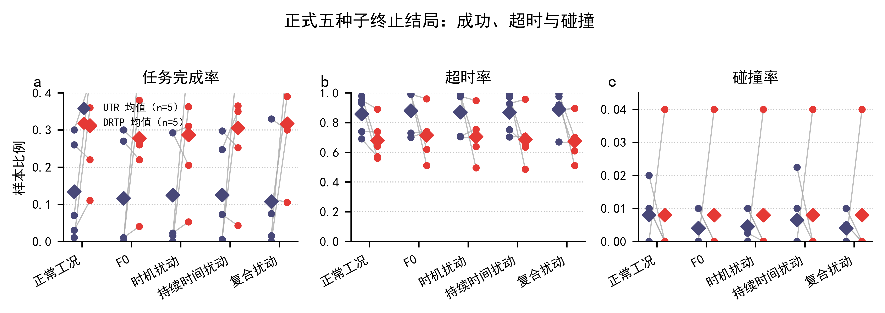

# 补充材料 S1｜正式主 cohort 的逐条件结果与安全审计

本补充材料对应主文的正式 UTR--DRTP 五种子 cohort（训练种子 2301--2305）。所有表均使用共同 10M final checkpoint 与 episode ID 490000--490099 的冻结 12 条件 tape。训练 seed 是独立统计单位；episode 仅构成同一 seed 内的条件估计，不能扩增为训练重复。

## S1.1 可复核源数据

- `../formal_results/source_data/per_seed_condition_summary.csv`：10 个 `method×seed` 单元在 normal、F0 和 10 个跨扰动条件上的完整汇总；包含 `J`、collision、timeout、constraint violation、failure exposure、risk-set 大小、存活比例、触发成功率、故障前碰撞、路径与信息边界诊断等字段。
- `../formal_results/source_data/formal_failure_safety_by_seed.csv`：每个 method×seed 的 1,100 个计划故障 episode 的 collision、timeout、constraint violation、pre-trigger collision、survival-to-onset、risk-set size 和 trigger validity。
- `../formal_results/source_data/formal_terminal_outcomes_by_seed_family.csv`：正常、F0、时机、持续时间和复合条件族下的 success/collision/timeout 结局。
- `../formal_results/source_data/evaluation_manifest.json` 与 `formal_tape_manifest.json`：条件清单、episode ID 和 tape 哈希。

这些 machine-readable 文件是逐条件数值表的正式载体；不以人工转录表替代原始汇总。

## S1.2 条件、性能与安全解释规则

1. `J_pert,mean` 和 `J_pert,worst` 是十个已见 topology perturbation 条件的汇总。归档字段 `J_OOD_mean`/`J_OOD_worst` 仅做可追溯映射，不意味着 strict OOD。
2. 所有计划故障 episode 保留在总体 collision、timeout、constraint 和任务得分中。故障 onset 前的 collision 是策略安全结果，不删除、不重标为 exposure。
3. 技术触发有效性仅在 onset 前存活的风险集上判定。正式 cohort 每个可触发 cell 的 risk-set trigger success rate 为 1.0；这不能抵消任一方法的 pre-trigger collision。
4. 主文报告的 collision--timeout 权衡必须与本表共同阅读：DRTP 的平均 timeout 较低，但碰撞率略高，且该代价主要集中于 seed2304；因此不得声称全安全端点均改善。

## S1.3 补充图S1｜终止结局

**图S1｜正式五种子终止结局。** 每个细点代表一个训练种子在指定条件族上的 episode 比率，灰线连接同一配对种子的 UTR 与 DRTP，菱形为五种子均值。所有 episode 均进入统计；故障前碰撞终止不被删除或重新标记。图中将更高任务完成率和更低超时率与碰撞率的局部上升同时呈现。

## S1.4 限制

此材料只报告正式主 cohort 的条件级事实，不与后续独立三方法 cohort 或历史 development/held-out strata 池化。跨 cohort 的方向差异见 S4；主文对此采用受限的可靠性结论。
