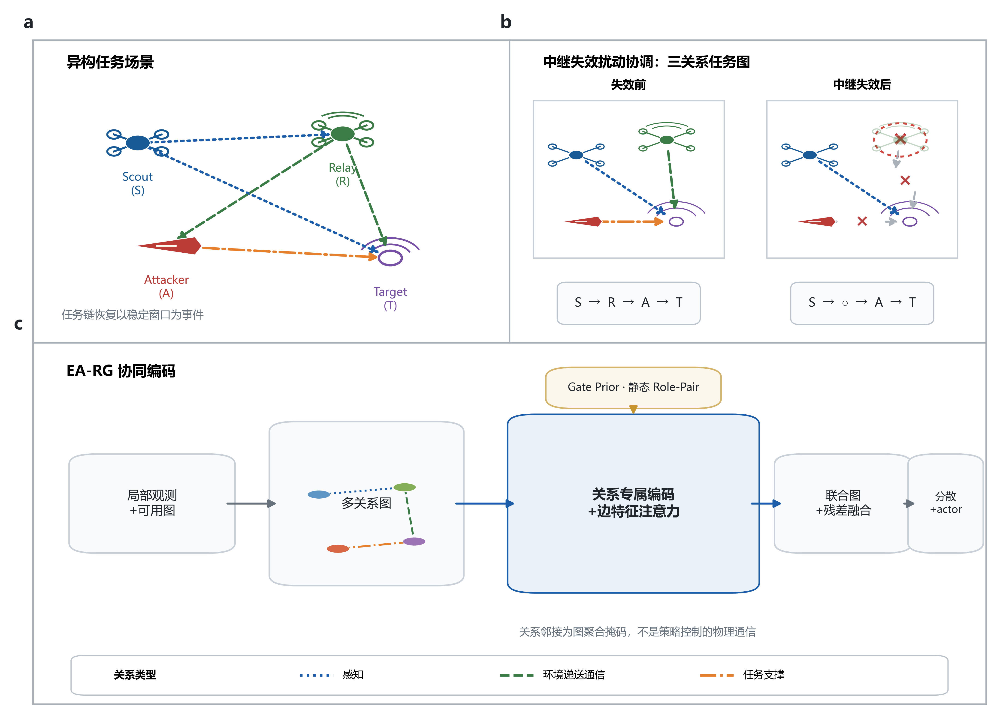
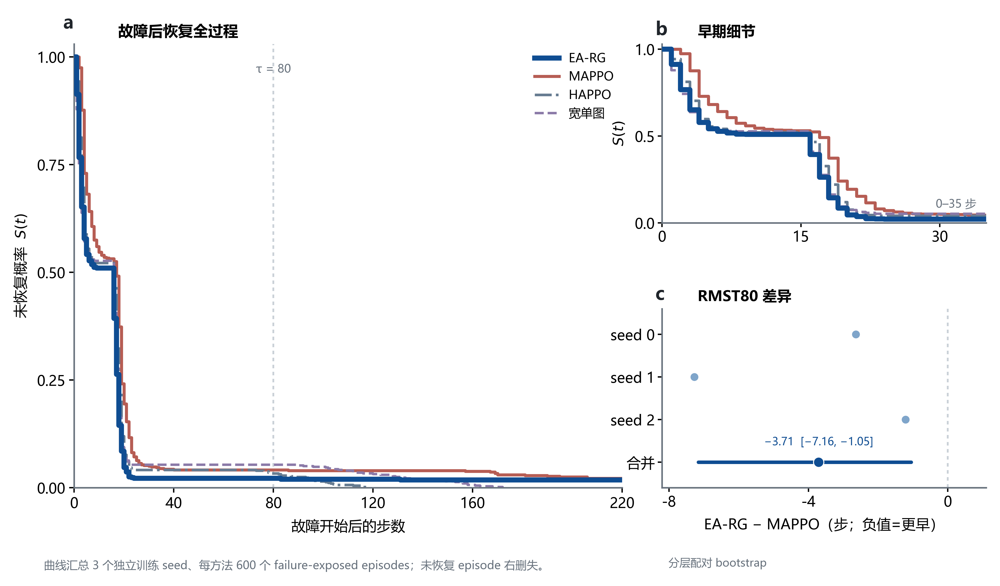

# 面向故障后任务链恢复的异构无人机多关系任务图协同决策

> 投稿作者、单位、基金、数据/代码可用性及目标期刊格式待作者补充。本稿是中文、期刊中性的证据驱动中间稿；数值和图表仅可由文末列出的锁定资产替换或渲染。

## 摘要

在间歇感知与受限通信下执行协同拦截的异构无人机编队，关键中继节点失效会中断任务链。仅报告终局成功率，不能说明编队在失效持续期间何时重新获得可执行的协同能力。本文研究故障后的任务链恢复时序，提出边感知角色图 MAPPO（Edge-Aware Role-Graph MAPPO，EA-RG-MAPPO-S；简称 EA-RG）：在集中训练、分散执行框架中，将感知、环境递送通信和任务支撑表示为三类关系，并以带边特征的关系专属图注意力及联合图残差聚合这些依赖。我们在锁定的 nominal held-out 评估中，以匹配的失效暴露 episode 为对象，使用 Kaplan–Meier 曲线和受限平均生存时间（RMST）刻画恢复。3 个独立训练 seed 的结果显示：在与节点失效持续时间对应的预设 \(\tau=80\) 步窗口内，EA-RG 的 RMST 为 11.81 步，MAPPO 为 15.51 步；Full−MAPPO 的三个 seed 差异均为负，分层配对 bootstrap 95% 区间为 [−7.16, −1.05] 步。至共同完整随访上限 \(\tau=220\)，EA-RG 对 MAPPO 仍较低，但与 HAPPO 及宽单图基线的比较不呈现一致 seed 方向。组件消融为三关系设计提供受限支持，零样本分布变化显示该优势依赖于变化类型。结果将贡献限定为：在锁定 nominal 条件下，多关系任务图与较早的故障后恢复相关，而非对所有基线或未知分布的普适优越。

**关键词：** 异构无人机；多智能体强化学习；故障后恢复；任务图；多关系图注意力；受限通信；生存分析

## 1 引言

多无人机协作的有效性取决于信息感知、信息传递与任务分工能否在动态条件下维持闭环。有限通信下的无人机协作、学习通信以及图结构的多智能体决策均已有研究基础 [@zhou2023racer; @zhu2024comm_madrl_survey; @das2019tarmac; @velickovic2018gat]。同时，已有空战决策工作已将图卷积或图表示与学习式决策结合 [@ou2024air_combat_gcn_drl; @huo2025graph_air_combat]。因此，本文不将图学习、学习通信或无人机图决策表述为首次工作。

本文聚焦一个更具体的问题：在严格感知边界、环境驱动的受限通信和关键中继节点失效同时存在时，编队何时重新形成稳定的任务链？这一问题不能仅由最终是否完成拦截来回答。若恢复事件可被明确界定，右删失的 episode 可通过 Kaplan–Meier（KM）曲线及预先指定窗口的 RMST 描述 [@kaplan1958; @royston2011rmst; @uno2014rmst]。由此，本文将故障后的恢复时序而非单一终局比率作为主要评价对象。

我们提出 EA-RG-MAPPO-S。该方法并不学习物理通信开关：通信可达性、时延、丢包与节点故障由环境决定。策略侧接收可用的图结构，并区分三类关系：有效感知、环境递送通信和任务支撑。任务支撑关系是对已递送通信的任务相关掩码，而非额外的物理消息信道。该表示经关系专属边特征注意力处理，再与联合图残差融合；Gate Prior 仅用于结构化初始化，Role-Pair 调制是静态辅助项。

本文的贡献是：

1. 定义了面向异构无人机协同拦截的故障后任务链恢复问题，并用匹配失效暴露下的事件时间分析使“何时恢复”成为可审计终点。
2. 提出三关系任务图编码和 EA-RG 策略结构，在不改变环境物理通信约束的前提下，区分感知、通信与任务支撑依赖。
3. 在锁定 nominal held-out 评估中，给出 EA-RG 相对 MAPPO 的可复现早期恢复证据，并明确披露全时域比较和零样本分布变化的边界。

## 2 问题定义与恢复评价

### 2.1 协同拦截与信息边界

场景包含 scout、relay、attacker 三个蓝方 actor 与一个目标节点。每个 actor 基于本地观测、可用通信历史及图输入执行动作；集中训练阶段的 critic 使用共享状态，执行阶段不依赖集中式图门控。环境根据距离、丢包、时延与故障决定通信是否递送。攻击窗口是局部节点状态，也是任务支撑边的激活条件之一，而不是第四类关系。

关键中继节点在预定窗口失效后，任务链可能失去必要的信息流或角色协同。本文把“稳定任务链窗口的起点减去故障开始时刻”定义为恢复时间；在可用随访结束前未恢复的 episode 按其可用随访时间右删失。这样，恢复不等同于单步观测重新出现，也不等同于 episode 终止时的最终成功。

### 2.2 主要统计对象

主生存分析限于 Early 与 Nominal 场景：每个 method × seed × scenario 单元有 100 个 failure-exposed episodes。独立实验单位是 3 个训练 seed，episode 是 seed 内的评估样本。以 \(\tau=220\) 表示共同完整随访上限；以 \(\tau=80\) 表示预设的节点故障活动窗口。KM 曲线用于展示恢复事件的累积分布，RMST 越小表示在相应时间窗内恢复越早。

Full 与比较方法的差异采用分层配对 bootstrap 估计：先重采样训练 seed，再在 seed × scenario 内对匹配 episode 索引重采样，共 10,000 次。该设计保留 episode 配对，但不把同一训练策略下的所有 episode 误作独立训练重复。

## 3 EA-RG-MAPPO-S

### 3.1 三关系任务图

令图节点集合由三个蓝方 actor 和一个目标组成。对每个时刻，图邻接包含下列三种关系：

- **感知关系：** 蓝方 actor 对目标的有效探测；
- **通信关系：** 环境实际递送的通信可达性；
- **任务支撑关系：** 同时满足角色兼容、通信已递送与信息状态相关条件的掩码。

三类关系的邻接张量形状为 \([3,N,N]\)。攻击窗口只以节点状态或任务支撑条件标记，不能被解释为独立关系或物理链路。每条边的特征参与注意力分数计算，关系邻接作为硬掩码；自环始终可用。

**图 1｜故障后协同的三关系任务图。** a，Scout–Relay–Attack–Target 异构任务场景及三类关系。b，中继失效前后的三关系任务图；失效使相应关系不可用，攻击窗口不构成第四类关系。c，局部观测和可用图经关系专属边特征注意力、Gate Prior 与静态 Role-Pair 调制、联合图残差融合后，供分散 actor 使用。感知为蓝色点线，环境递送通信为绿色虚线，任务支撑为橙色点划线；关系邻接是图聚合掩码，而非策略学习的物理通信开关。

### 3.2 关系聚合与训练边界

策略编码器由两层关系专属 RoleConditionedGAT 与联合图 GAT 残差组成。边特征调制注意力，角色对门仅由关系类型和角色对决定，不随输入或故障状态动态变化。Gate Prior 将选定角色对 logit 初始化为 0.4；它是优化初始化，而非运行时故障自适应、消息压缩或链路剪枝机制。actor 在执行期使用局部/图输入，critic 的共享状态不以图门作为额外通信通道。

## 4 实验设计与证据链

### 4.1 锁定评估

nominal held-out 套件共包含 10,800 个 episode。主要事件时间分析使用其中 Early 与 Nominal 的匹配失效暴露子集；每个方法在 3 个训练 seed 上分别具有 600 个暴露 episode。除非另有说明，汇总值均为 3 个独立训练 seed 的均值 ± 样本标准差。终局 recovery、success 与仅在已恢复且失效暴露 episode 上定义的条件平均恢复时间 \(t_{rec}\) 仅作描述性补充；RMST 是主要时间终点。

基线包括 MAPPO、HAPPO 和宽单图；组件比较包括移除 Gate Prior、Task-Support 与 Role-Pair 调制。零样本 OOD 评估被用作适用边界，而非用于重新选择方法或时间窗。

### 4.2 结果呈现原则

主文以 P1（主要恢复证据）→ P2（组件支持）→ P3（必要边界）顺序组织。完整 KM 曲线、逐 seed RMST、全量鲁棒性、Gate Prior 轨迹、效率 profile、OOD 逐单元结果及开发期资产放入补充材料。

## 5 结果

### 5.1 EA-RG 在故障活动窗口内相对 MAPPO 更早恢复

图 2 与表 1 报告锁定 held-out 的主要证据。在 \(\tau=80\) 的预设窗口内，EA-RG 的 RMST 为 11.81 步，低于 MAPPO 的 15.51 步。Full−MAPPO 的三个训练 seed 差异依次为 −2.64、−7.27 和 −1.21 步，分层配对 bootstrap 95% 区间为 [−7.16, −1.05] 步。这说明在失效节点仍处于失效状态的窗口中，EA-RG 在三个独立训练重复中均较早恢复任务链。

在 \(\tau=220\) 的共同完整随访上限，EA-RG 的 RMST 为 \(14.47\pm3.10\) 步，MAPPO 为 \(20.39\pm7.72\) 步。与此同时，HAPPO 为 \(14.14\pm2.94\) 步，宽单图为 \(16.49\pm8.64\) 步；EA-RG 与后二者的逐 seed 差异并不一致。因此，完整随访的证据支持“竞争性表现”，不支持对所有基线的统一优越。

**图 2｜匹配失效暴露下的早期任务链恢复。** a，EA-RG、MAPPO、HAPPO 和宽单图的完整 KM 曲线；细虚线标出预设故障持续窗口的终点 \(\tau=80\)。b，0–35 步的早期细节，显示主要分离发生的时间段。c，EA-RG−MAPPO 的 RMST80 逐 seed 差异与合并的 hierarchical paired-bootstrap 95% 区间；负值表示 EA-RG 更早恢复。曲线汇总 3 个独立训练 seed、每方法 600 个 failure-exposed episodes；未恢复 episode 右删失。

| 方法 | Recovery | Success | 条件平均 \(t_{rec}\)（步） | RMST80（步） | RMST220（步） |
|---|---:|---:|---:|---:|---:|
| EA-RG Full | \(0.9706\pm0.0213\) | \(0.9850\pm0.0109\) | \(10.8\pm0.6\) | 11.81 | \(14.47\pm3.10\) |
| MAPPO | \(0.9471\pm0.0514\) | \(0.9708\pm0.0290\) | \(17.4\pm7.2\) | 15.51 | \(20.39\pm7.72\) |
| HAPPO | \(1.0000\pm0.0000\) | \(1.0000\pm0.0000\) | \(16.3\pm4.1\) | — | \(14.14\pm2.94\) |
| 宽单图 | \(0.9949\pm0.0087\) | \(0.9967\pm0.0058\) | \(26.2\pm23.6\) | — | \(16.49\pm8.64\) |

**表 1｜锁定 held-out 的主要结果。** Recovery 和 Success 为 3 个训练 seed 的均值 ± 样本标准差。条件平均 \(t_{rec}\) 仅在 failure-exposed 且已恢复的 episode 中定义，不能替代含右删失的 RMST。RMST80 的比较仅将 EA-RG 与 MAPPO 作为预设 P1 主对比；其余 RMST80 值转入补充材料。

### 5.2 组件证据限定了方法的可解释范围

表 2 汇总了主要组件比较。去除 Gate Prior 后，RMST220 从 \(14.47\pm3.10\) 增至 \(48.48\pm41.72\) 步；去除 Task-Support 后增至 \(29.57\pm24.31\) 步。二者均存在较大的跨 seed 异质性，故其含义分别限于结构化初始化和任务相关关系的经验性支持，不能被解释为在线故障适应机制或已证明的恢复重组因果机制。

去除静态 Role-Pair 调制的 RMST220 为 \(13.63\pm3.86\) 步，且与 Full 的逐 seed 差异方向混合。因而，当前证据不支持将 Role-Pair 调制作为独立性能创新；它仅保留为整体编码器的辅助设计。

| 变体 | Recovery | Success | 条件平均 \(t_{rec}\)（步） | RMST220（步） | 受限裁决 |
|---|---:|---:|---:|---:|---|
| EA-RG Full | \(0.9706\pm0.0213\) | \(0.9850\pm0.0109\) | \(10.8\pm0.6\) | \(14.47\pm3.10\) | — |
| w/o Gate Prior | \(0.7716\pm0.2442\) | \(0.8642\pm0.1520\) | \(15.3\pm2.5\) | \(48.48\pm41.72\) | 结构化初始化的支持证据 |
| w/o Task-Support | \(0.8918\pm0.1600\) | \(0.9392\pm0.0906\) | \(15.0\pm4.5\) | \(29.57\pm24.31\) | 任务相关关系的经验性支持 |
| w/o Role-Pair | \(0.9902\pm0.0051\) | \(0.9942\pm0.0029\) | \(13.8\pm5.6\) | \(13.63\pm3.86\) | 无稳定独立增益 |

**表 2｜受控组件消融。** 均值 ± 样本标准差基于 3 个独立训练 seed。条件时间与 RMST 的估计对象不同；机制轨迹和逐 seed 细节见补充材料。

### 5.3 零样本分布变化的优势具有条件性

在预先锁定的 7 个 OOD 单元中，Full−MAPPO 的等权 RMST80 聚合差异为 \(+2.565\pm5.567\) 步；分层配对 bootstrap 95% 区间为 [−2.362, +8.435] 步，三个训练 seed 的方向为 −2.420、+1.543 和 +8.571 步。按变化族汇总，几何变化保留了部分早期恢复收益，通信拓扑变化可使比较反转，而机动变化出现 RMST80 上限饱和。该分析界定了 nominal 结果的适用边界：不能从 P1 推出对未知变化的普适迁移。逐单元数值、饱和审计与完整曲线放入补充材料。

| 变化族 | Full−MAPPO 的 RMST80 家族结论 | 主文解释 |
|---|---|---|
| 几何 | −1.08 步 | 部分保留早期恢复收益 |
| 通信拓扑 | +10.06 步 | 比较可反转 |
| 机动 | 0.00（上限饱和） | 所有比较方法均受机动变化压制，不能解释为方法等价 |
| 联合 | 0.00（上限饱和） | 同上 |

**表 3｜零样本 OOD 的必要边界。** 数值为锁定 family-level 汇总，仅用于描述变化依赖性；不作 p 值或普适泛化结论。

## 6 讨论

本文的证据把协同故障恢复从“任务最终是否完成”转为“故障仍在持续时，任务链何时重新可用”。这一改变具有评价上的含义：当终局 Recovery 和 Success 已接近饱和时，它们难以区分中继失效期间的协同质量；与故障持续窗口对齐的事件时间终点则保留了恢复过程的时序差异。锁定 nominal held-out 中 EA-RG 相对 MAPPO 的 RMST80 差异表明，异构协同策略的比较可以围绕可审计的恢复时序展开，而不只围绕 episode 末端状态。

这一结果不意味着策略学习了新的物理通信协议。三关系编码只是将可感知、环境已递送和任务相关的依赖分别提供给图聚合器；通信可达性仍由环境决定。组件消融与该表示作为整体设计的一部分相一致，但其跨 seed 异质性不足以区分每个组件的独立因果作用。因此，本文将方法层面的贡献限定为一种与较早恢复相关的任务图表征与评价设计，而不是已证实的故障后关系重组机制。

这一解释也有清晰的适用边界。完整随访中，EA-RG 与 HAPPO、宽单图不呈现统一优势，说明早期恢复并不自动外推为所有时间尺度上的全面排序；通信拓扑变化可使相对 MAPPO 的比较反转，说明 nominal 优势不能替代跨分布验证。当前证据来自 3DOF 受控仿真，尚未覆盖真实传感器、真实通信系统或 6DOF 飞行平台。后续工作应在预先设计的变化协议和可观测故障条件下，检验哪些任务关系在何种变化下仍能支持较早恢复。

## 7 结论

本文提出以三关系任务图表示异构无人机协同中的感知、环境递送通信与任务支撑依赖，并以故障后任务链恢复作为主要评价对象。在锁定 nominal held-out 的节点失效活动窗口内，EA-RG 相对 MAPPO 呈现一致的较早恢复。该发现支持将事件时间分析纳入故障协同的评价，而非把它推广为对所有基线、时间尺度或未见分布的普适优越。后续工作应在更高保真动力学、可观测故障条件和预先设计的跨分布协议中检验这一恢复规律。
